# Docker&Kubernetes 4주차 스터디 정리

- 1주차 스터디
  - [Dockerfile을 이용한 서버 배포](http://javaexpert.tistory.com/967?category=719756)
- 2주차 스터디
	- [Docker-compose 입문](http://javaexpert.tistory.com/975?category=719756)
- 3주차 스터디
	- [github를 통해 aws ec2로 자동 배포 #1](http://javaexpert.tistory.com/984?category=719756)

## 스터디 내용
- Github 배포
- Travis CI 환경설정 추가 및 구성
- ec2 elastic beantalk 구성 및 자동 배포

## 개발 flow

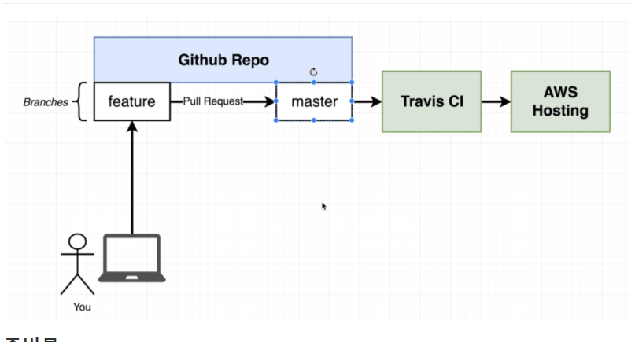

## 준비물

- Github 계정
- [Travis CI 계정](https://travis-ci.org/)
- AWS Free tier 계정

그럼 시작해보자. 

### Github 설정

1. 깃헙 레포를 만든다. 
2. 현재 소스를 깃헙 레포와 연결한다. 
3. 깃헙에 푸시한다. 

```
git init
git add .
git commit -m "first commit"
git remote add origin https://github.com/bear2u/docker-react2.git
git push -u origin master
```

Github에 푸시를 했으면 정상적으로 파일이 다 올라간 걸 확인할 수 있다. 

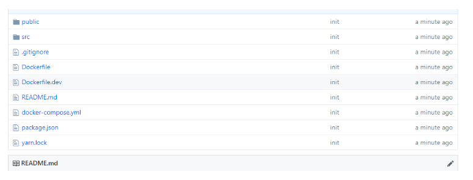

### Travis 설정

https://travis-ci.org/ 에 가서 깃헙에 연동해서 로그인을 하자. 

설정에 가면 내가 가진 모든` repository` 가 나올텐데 거기에서 금방 올린 `docker-react2` 라는 `repo`를 검색해서 활성화를 해준다. 


그럼 `docker-react2` 를 클릭하면 처음 연동을 하면 비어있는 빌드 목록을 볼수 있을 것이다. 

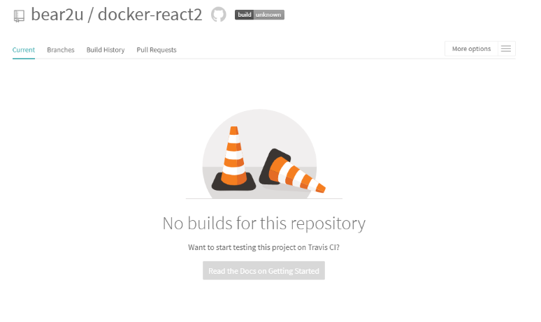


그럼 순서는 어떻게 이루어지는 지 살펴보자. 

1. **Travis에게 우리는 동작되는 도커의 카피를 하라고 말한다.** 
2. **그리고 Dockerfile.dev를 통해서 이미지를 만들고**
3. **Travis에게 테스팅을 돌려서 문제가 없는지 체크**
4. **마지막으로 `Travis -> Aws E/B` 에게 배포를 말함**


이제 소스에서 `Travis` 환경설정 파일을 만들어 주면 된다. 

- 파일이름 : `.travis.yml`

```
#1
sudo: required
#2
services:
  - docker
#3
before_install:
  - docker build -t bear2u/docker-react -f Dockerfile.dev .
#4
script:
  - docker run bear2u/docker-react npm run test -- --coverage
```

1. 관리자 권한 필요하다. 
2. 서비스를 어떤 게 필요한지를 미리 정의
3. 사전 설치
   1. 현재 위치에서 Dockerfile.dev를 이용해서 빌드한다.
4. `docker test`을 하는데 커버리지를 지정한다. 

그럼 이제 일단 테스팅이 잘 되는지 살펴보자. 

```
git add .
git commit -m 'added travis config'
git push origin master
```

푸시가 되면 `travis` 에서 자동적으로 시스템이 시작된다. 


정상적으로 테스팅 결과가 나오는 지 확인해본다. 

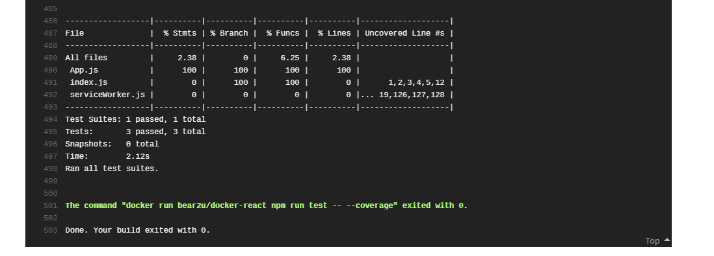

### AWS Elastic Beanstalk 설정

AWS Elastic Beanstalk은 도커나 가상 앱을 EC2나 S3를 통해서 바로 올릴수 있도록 도와주는 서비스인것 같다. 

이제 aws 에서 Elastic Beanstalk 서비스를 찾아서 어플리케이션을 만들자. 

- Apllication Name: docker-react
- Sample App

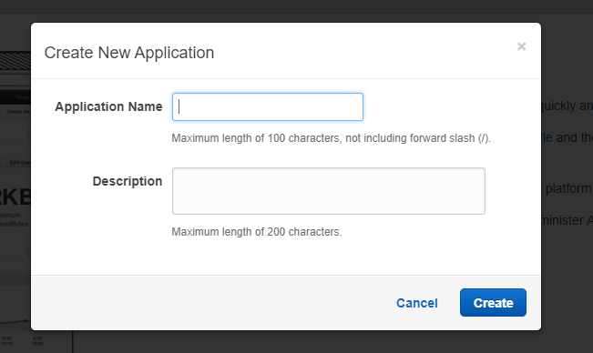


플랫폼을 `docker`로 선택해야 한다. 그리고 `Create environment `

완료가 되는 경우 오른쪽 상단에 링크를 클릭시 샘플 앱이 실행되는 걸 확인할 수 있다. 


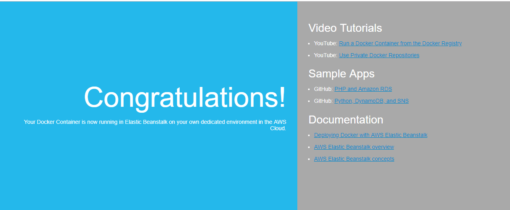

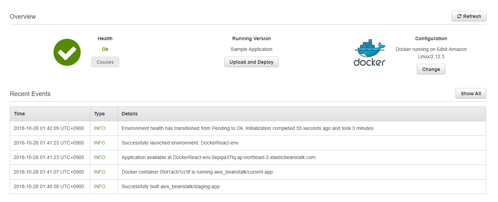

### Travis + aws e/b 설정

그럼 travis 설정에서 aws 에 배포하는 내용을 추가하도록 하자. 

- `bucket_name` 의 경우 S3의 위치를 뜻한다. 

```
#1
sudo: required
#2
services:
  - docker
#3
before_install:
  - docker build -t bear2u/docker-react -f Dockerfile.dev .
#4
script:
  - docker run bear2u/docker-react npm run test -- --coverage

deploy:
  provider: elasticbeanstalk
  region: "ap-northeast-2"
  app: "docker-react"
  env: "DockerReact-env"
  bucket_name: "elasticbeanstalk-ap-northeast-2-110932418490"
  bucket_path: "docker-react"
  on:
    branch: master
```

### aws e/b api 키 설정

Travis 에서 aws에 배포할려면 api 가 필요하다. 

이 api 서비스를 이용하기 위해선 aws에서` iam` 이 필요하다. 

유저를 추가해준다. 

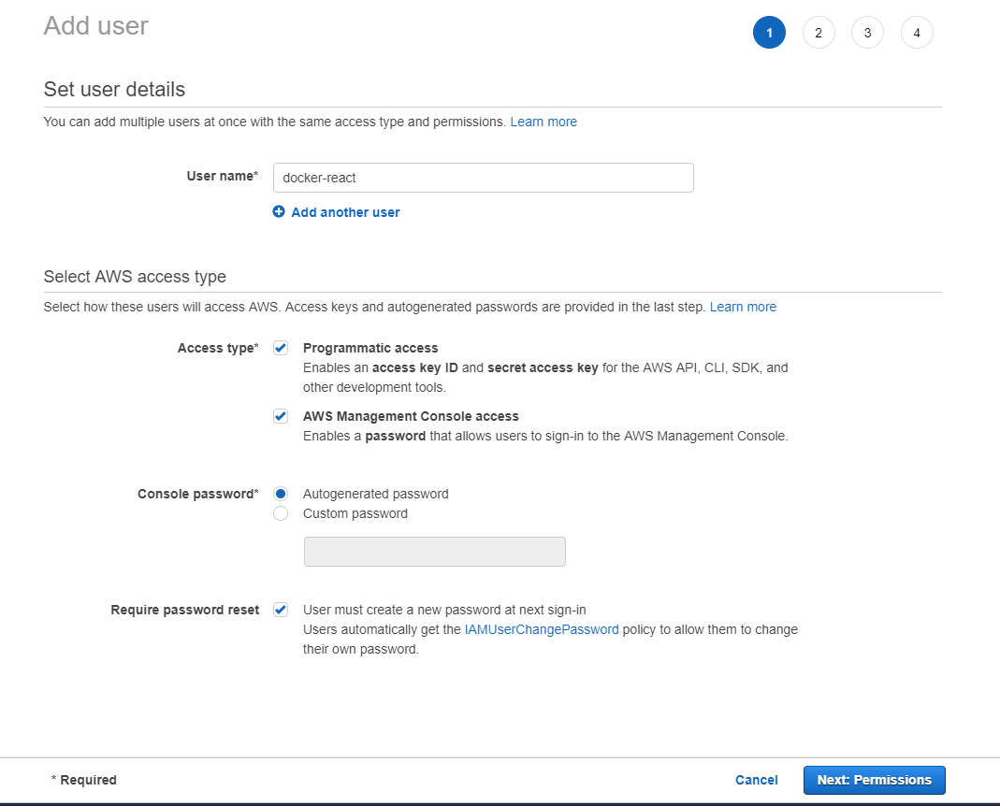


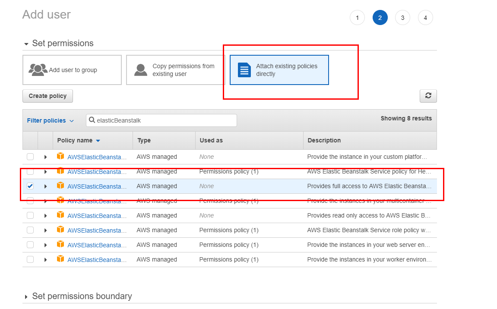


마지막에 까지 진행시 나오는 액세스키와 secret 키가 중요하기 때문에 꼭 백업해놓자. 

### Travis 에 Access Key 와 Secret Key 설정

Travis에서 `docker-react2` 클릭 후 설정에 들어가서 키를 2개를 입력해놓으면 된다. 이 입력해놓은 걸 나중에 travis.yml 에서 변수명으로 가져와서 사용할 수 있는 것이다. 


travis.yml 파일에 마지막에 api를 추가해준다. 

```
  access_key_id: $AWS_ACCESS_KEY
  secret_access_key:
    secure: "$AWS_SECRET_KEY"
```

그럼 다시 테스트를 해보자. 

```
git add .
git commit -m 'added aws eb'
git push orgin master
```

그런데 ***aws e/b 대쉬보드에서 확인해보면 실패***가 뜬다. 

이유는 포트를 오픈을 안했다. 

### 포트 개방

- Dockerfile

- `EXPOSE 80`

  ```
  FROM node:alpine as builder
  WORKDIR '/app'
  COPY package.json .
  RUN npm install
  COPY . .
  RUN npm run build
  
  FROM nginx
  EXPOSE 80
  COPY --from=builder /app/build /usr/share/nginx/html
  ```

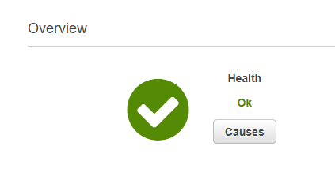

aws에서 성공적으로 올라가졌는지 체크해보자. 

링크도 클릭해서 잘 나오는지 확인해보자. 

## 빌드 실패가 계속 나오는 경우

EC2 프리티어중 t2.micro 인스턴스가 주로 npm install 사용시 타임 아웃이 걸리는 문제가 발생될 수 있다. 

Dockerfile 에 수정을 이렇게 해보자. 

```
COPY package*.json ./
```

## 브랜치 변경

처음 계획은 feature 라는 브랜치에 푸시를 하면 마스터에 머지를 하고 테스팅을 돌려서 배포까지 하는 구조를 말했다. 

```
git checkout -b feature
```

그리고 소스를 수정하고 

- src/App.js
- Good Choice React in feature

```
import React, { Component } from 'react';
import logo from './logo.svg';
import './App.css';

class App extends Component {
  render() {
    return (
      <div className="App">
        <header className="App-header">
          
          <p>
            Good Choice React in feature
          </p>
          <a
            className="App-link"
            href="https://reactjs.org"
            target="_blank"
            rel="noopener noreferrer"
          >
            Learn React
          </a>
        </header>
      </div>
    );
  }
}

export default App;

```

## 새로운 브랜치  Push, PR, Merge

다시 푸시를 한 뒤에 github 에 들어가서 머지를 해보자. 


새로운 브랜치를 만들었기 때문에 travis 가 설정하게끔 해줘야 한다. 

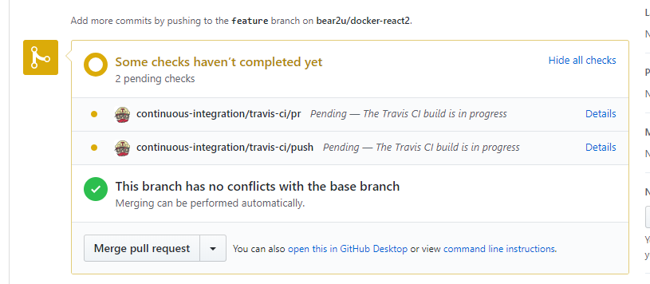


이제 정상적으로 머지를 하면 된다. 

그럼 자동적으로 travis로 신호를 줘서 테스팅 및 배포를 하게 된다.

이제 다시 수정된 화면을 보자.

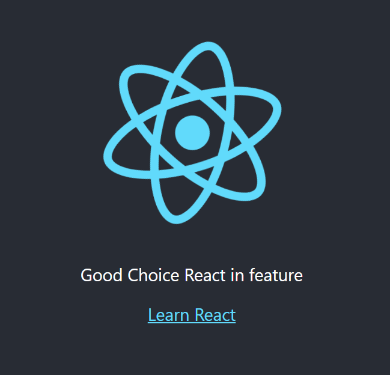


정상적으로 수정된 내용이 나오는 걸 볼수 있다. 

끝나면 삭제를 하면 된다. 

오른쪽 위에 메뉴에 삭제를 할수 있다.

여기까지 4주차 도커&쿠버네이트 스터디 정리 내용이다. 