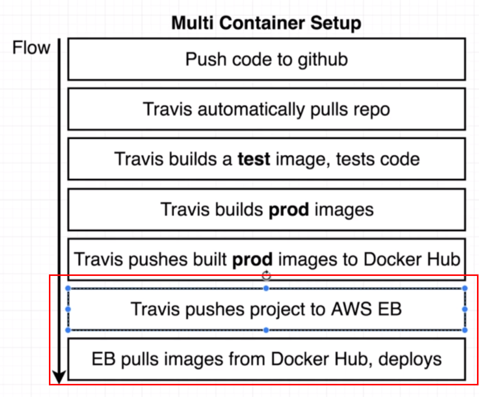
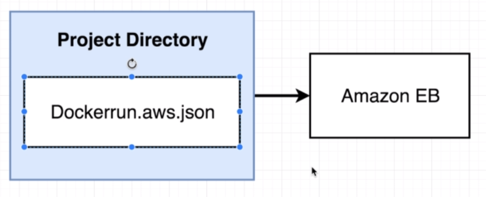
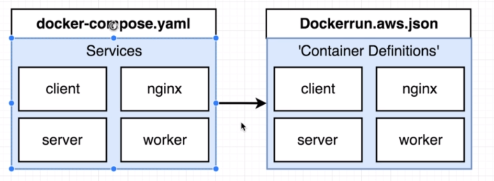
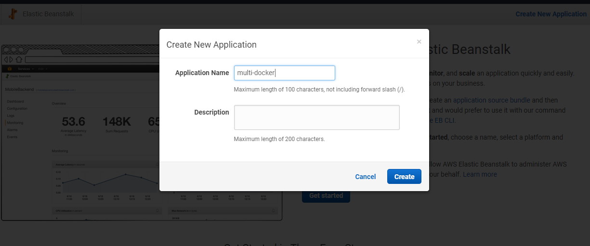
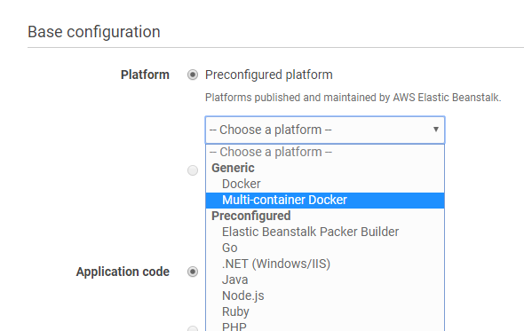
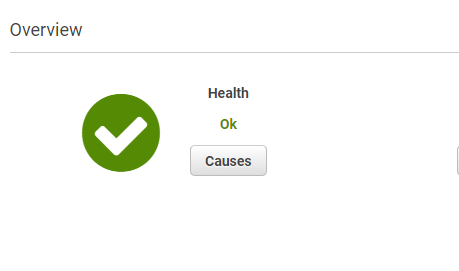
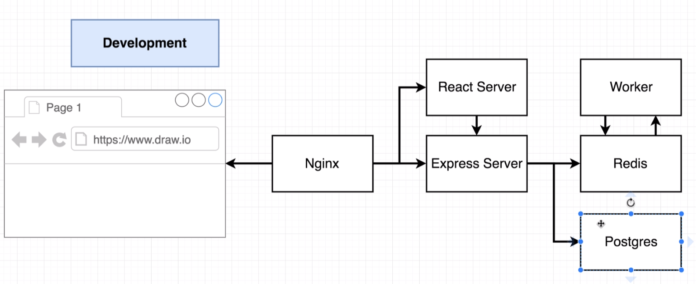
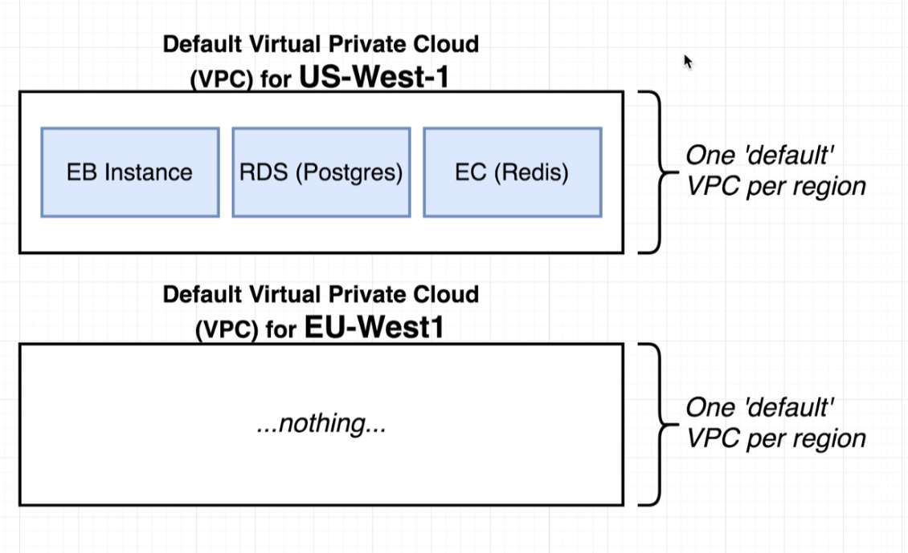
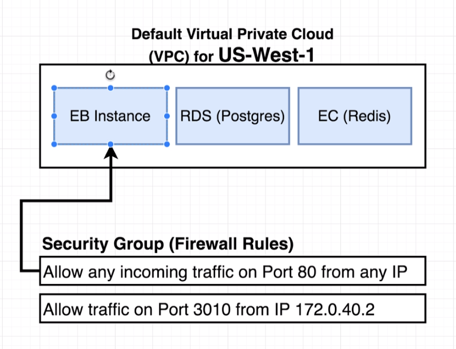
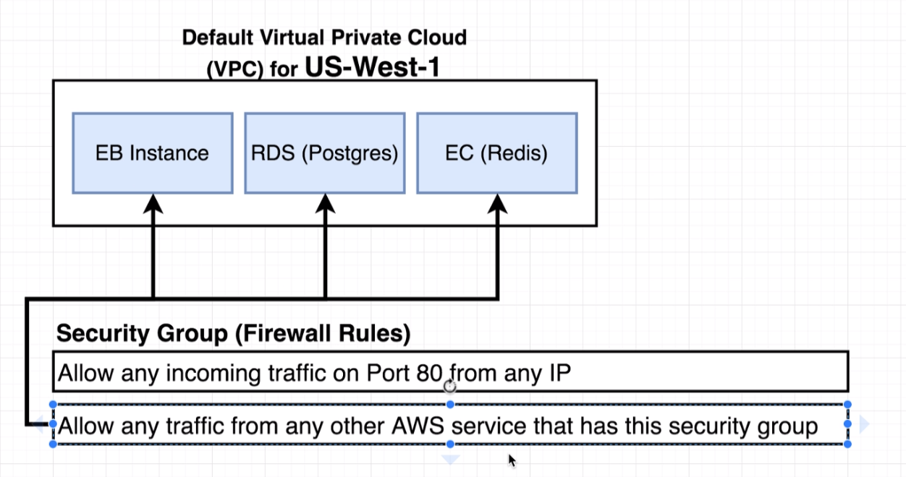

# 도커&쿠버네티스 7주차 스터디 정리내용

> 부산에서 매주 진행되는 스터디입니다.
>
> 부산에서 다른 스터디 내용을 보실려면 [카페](https://cafe.naver.com/busandev) 에서 보실수 있습니다.
>
> <https://www.udemy.com/docker-and-kubernetes-the-complete-guide> 을 공부하고 있습니다

1주차 스터디

- [Dockerfile을 이용한 서버 배포](http://javaexpert.tistory.com/967?category=719756)

2주차 스터디

- [Docker-compose 입문](http://javaexpert.tistory.com/975?category=719756)

3주차 스터디

- [github를 통해 aws beanstalk로 자동 배포 #1](http://javaexpert.tistory.com/984?category=719756)

4주차 스터디

- [github를 통해 aws beanstalk로 자동 배포 #2](http://javaexpert.tistory.com/986)

5주차 스터디

- [복잡한 형태의 서비스를 도커로 배포하기](http://javaexpert.tistory.com/990)

6주차 스터디

- [Docker hub를 Travis를 통해서 자동 배포하기](http://javaexpert.tistory.com/996)

## 이번주 스터디 내용

이번주는 저번 시간에 이어서 `Dockerhub`로 올린 이미지를 `aws`에 `beanstalk`로 올리는 걸 진행하도록 하겠다. 

[4주차](http://javaexpert.tistory.com/984?category=719756)에는 바로 도커이미지를 `aws beanstalk` 로 올리는 걸 진행했었다. 

이제는 실제 Production에 사용되는 형태로 진행하는 걸 배워볼 것이다. 

> 여기서 진행된 소스는 여기 [Github](https://github.com/bear2u/docker-study2) 에서 받을수 있다. 

배우게 되는 내용

- `AWS EC2 Task Definition`
- `AWS VPS 등 기본 설정`



## AWS EB 설정

aws eb에 여러개의 도커 이미지(`client`,` server`, `worker`)등을 올리기 위해서는 설정 파일이 필요하다. 

- `Dockerrun.aws.json`





## AWS ECS Task Definition

Beanstalk 에는 어떻게 컨테이너들이 동작될지를 알수가 없다. 그래서 `aws ec2`에서는 `task definition` 기능을 통해서 이미지를 어떻게 동작될지를 정의를 할 수 있다. 

- [AWS EC2 Task definition](https://docs.aws.amazon.com/AmazonECS/latest/developerguide/task_definitions.html)
- [AWS EC2 Task definition Container parameters](https://docs.aws.amazon.com/AmazonECS/latest/developerguide/task_definition_parameters.html#container_definitions)


## 실습

> `/Dockerrun.aws.json`
>
> `Dockerhub` 에 올라간 `tag/name` 을 확인하자.

- `name`  : 이미지 이름

- `image` : 도커 허브에 올라간 이미지 이름

- `hostname` : `docker-compose.yml` 에 있는 이름

- `essential` : 만약 콘테이너가 어떤 이유로 문제가 생겼을 경우 연관되어 있는 다른 컨테이너들을 같이 내릴건지 여부 ( `true` 이면 다같이 내린다. )

- `memory` :  각 컨터이너마다 얼마나 메모리를 할당할건지 지정

- `portMapping` : 외부 포트와 내부 콘테이너 포트를 바인딩

- `links` : 콘테이너가 연관되어 있는 걸 연결한다. 

  

- 
```javascript
{
    "AWSEBDockerrunVersion" : 2,
    "containerDefinitions" : [
        {
            "name": "client",
            "image": "bear2u/multi-client",
            "hostname": "client",
            "essential": false,
            "memory": 128
        },
        {
            "name": "server",
            "image": "bear2u/multi-server",
            "hostname": "api",
            "essential": false,
            "memory": 128
        },
        {
            "name": "worker",
            "image": "bear2u/multi-worker",
            "hostname": "worker",
            "essential": false,
            "memory": 128
        },
        {
            "name": "nginx",
            "image": "bear2u/multi-nginx",
            "hostname": "nginx",
            "essential": true,
            "portMappings": [
                {
                    "hostPort": 80,
                    "containerPort": 80
                }
            ],
            "links": ["client", "server"],
            "memory": 128
        }
    ]
}
```

## Aws Beanstalk

AWS 콘솔에 들어가서 새로운 어플리케이션을 만들어준다. 

- `multi-docker`



> create one > `Multi-container Docker` 선택







## Prod. 구조

`Dockerrun.aws.json` 내부에는 따로 `postgres` 와 `redis` 에 관한 DB 콘테이너가 없다. 그러면 어떻게 설정할까?

> 기존에 배웠던 개발 구조



> 배우게 될 배포(`Production`) 구조


위 그림에서 보다시피 `Redis` 는 `AWS Elastic cache` 로 빠져있고 `postgres` 는 `aws rds` 로 빼서 사용하고 있는 걸 볼수 있다.  가능하다면 이런 구조를 만드는게 더 이점이 많다고 한다.

이렇게 빼는 이유에 대해서 알아보자. 

### AWS Elastic Cache (Redis)

- 자동으로 redis 인스턴스를 만들어주고 유지보수 해준다. 
- 스케일링하기 쉽다.
- 로깅 및 유지관리
- 보안성이 우리가 하는것보다 전문가들이 하기 때문에 더 안전하다. 

### AWS RDS (Postgres)

- 자동으로 postgres 인스턴스를 만들수 있고 유지보수 하기도 쉽다.

- 스케일링 하기 쉽다.

- 로깅 및 유지보수하기 쉽다. 

- 우리가 하는것보다 안전하다. 

- 자동으로 백업 및 롤백 지원


다음에는 내부 콘테이너에 넣어서 하는 방법에 대해서도 공부할 예정이다. 

## EB와 DB 연결


현재로써는 EB에서는 RDS와 EC 연결을 서로 알수 없는 구조이다. 이걸 연결하기 위해서는 aws 콘솔에서 서로 묶어주는 게 필요하다. 





## VPC

VPC 에 가보면 `MultiDocker-env` 라는 `security group` 이 만들어진 걸 볼 수 있다. 


## EB 와 DB 간의 연결



### Postgres 생성

1. RDS` (`postgres`) 를 만든다. 

 > 하단에 프리티어 체크 박스를 꼭 활성화를 해주자.

   

3. `Postgress` 기본 입력

- `identifier`: multi-docker-postgress
- `username` : postgres
- `password` : postgresspassword


### Elastic chache (Redis) 생성


> `Node type` 값을 `t2`로 선택을 하는 걸 꼭 유의하자. 


### Create Security Group


### inbound 설정


### 각 서비스 Security Group 지정

- 방금 만든 `security` 설정을 `elasticache`와 `rds` 에 지정해준다.

#### REDIS VPC 지정


#### RDS 수정


#### Elastic Beanstalk 수정


#### EB 환경설정


#### Redis Host


#### RDS Host


#### AWS IAM 키 설정 

> `Service` 에서 `IAM` 검색해서 들어가자


#### Travis Setting

> `Travis` -> github -> id 설정


#### .Travis.yml deploy 설정

```yml
sudo: required
services:
  - docker

before_install:
  - docker build -t bear2u/react-test -f ./client/Dockerfile.dev ./client

script:
  - docker run bear2u/react-test npm test -- --coverage

after_success:
  - docker build -t bear2u/multi-client ./client
  - docker build -t bear2u/multi-nginx ./nginx
  - docker build -t bear2u/multi-server ./server
  - docker build -t bear2u/multi-worker ./worker
  # Log in to the docker CLI
  - echo "$DOCKER_PASSWORD" | docker login -u "$DOCKER_ID" --password-stdin
  # Take those images and push them to docker hub
  - docker push bear2u/multi-client
  - docker push bear2u/multi-nginx
  - docker push bear2u/multi-server
  - docker push bear2u/multi-worker

# add this
deploy:
  provider: elasticbeanstalk
  region: ap-northeast-2
  app: multi-docker
  env: MultiDocker-env
  bucket_name : elasticbeanstalk-ap-northeast-2-234249885524
  bucket_path : docker-multi
  on:
    branch: master
  access_key_id: $AWS_ACCESS_KEY
  secret_access_key:
    secure: $AWS_SECRET_KEY

```

#### 배포

이제 `github master` 브랜치에 수정된 내용을 `push`를 해보고 `travis`와 `beanstalk` 에서 결과를 확인하자. 


만약에 `beanstalk` 에 문제가 발생한 경우 `Logs` 를 통해서 확인 가능하다. 


#### Cleaning Service

테스팅을 완료했으면 aws 리소스들을 삭제하자. 

- `beanstalk`
- `rds`
- `redis`
- `iam`
- `security group`
- `vpn`

여기까지 7주차 스터디 내용이다. 다음주부터 본격적으로 `쿠버네티스`를 통해 관리하는 걸 진행하도록 한다. 

참석해주셔서 감사합니다. 