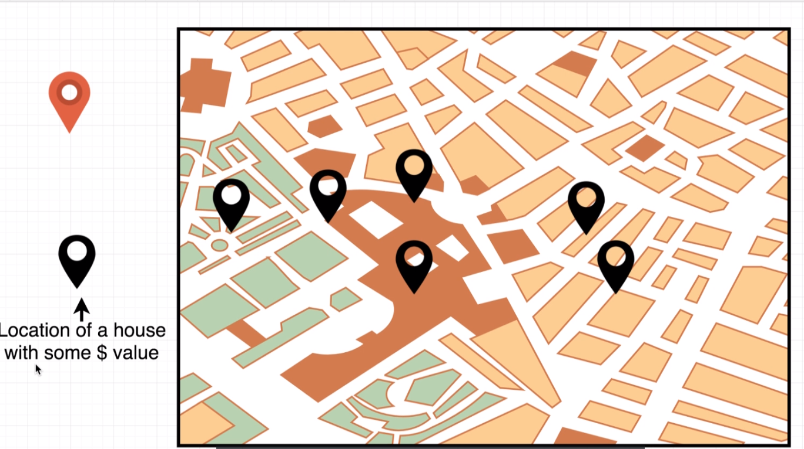
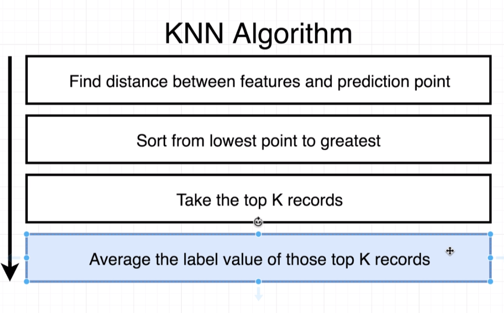
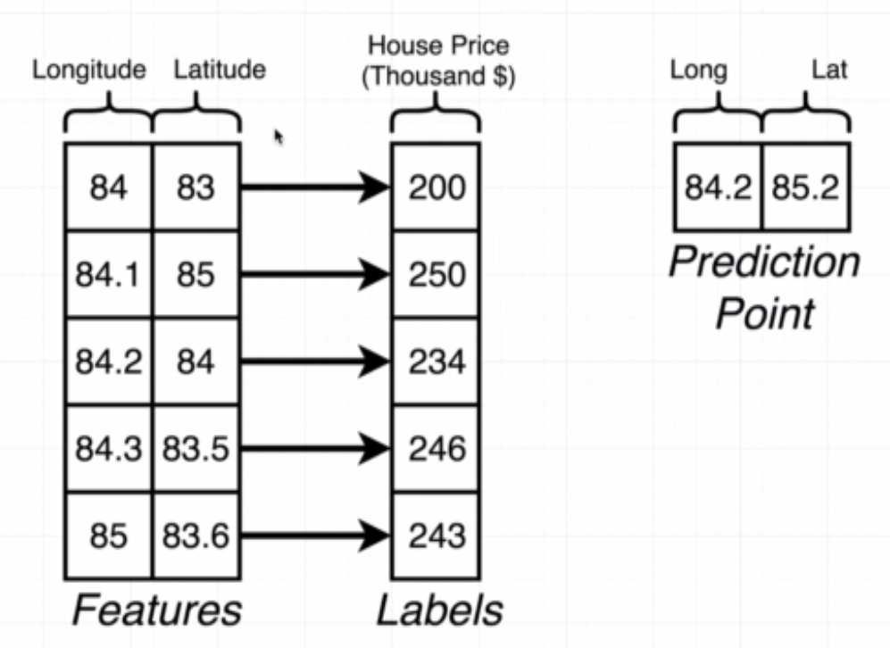
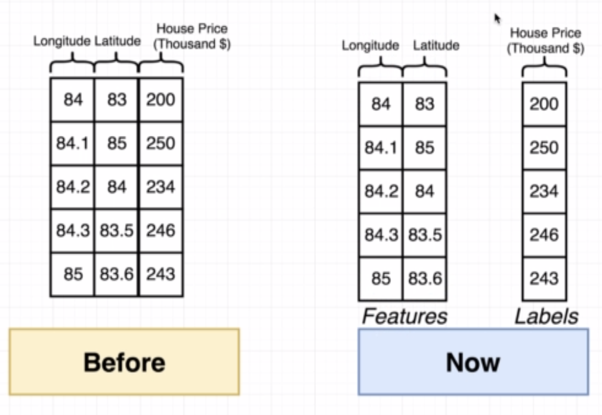
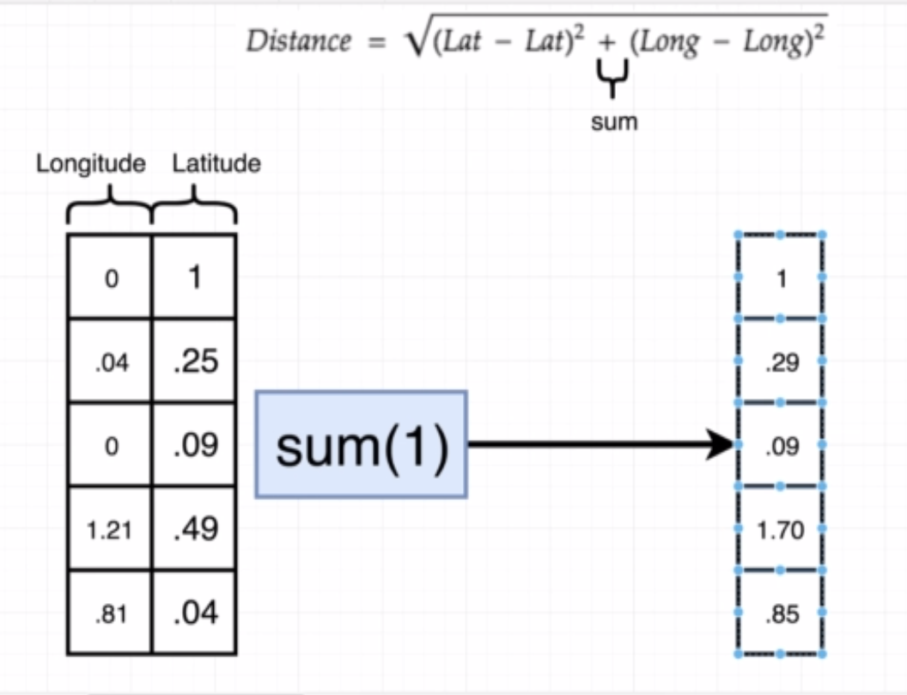
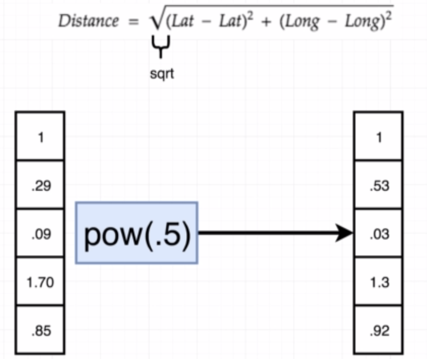
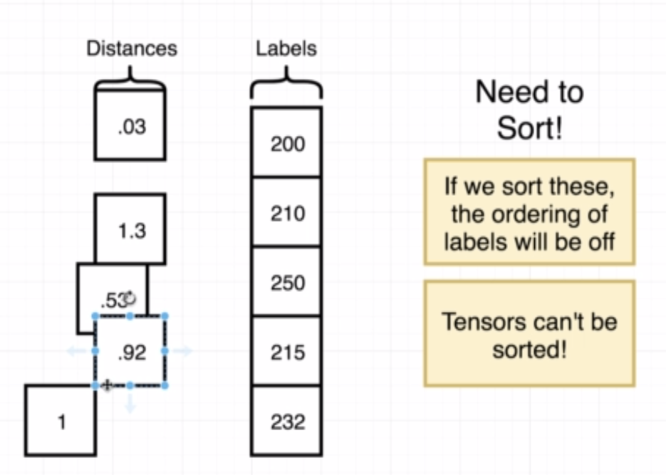
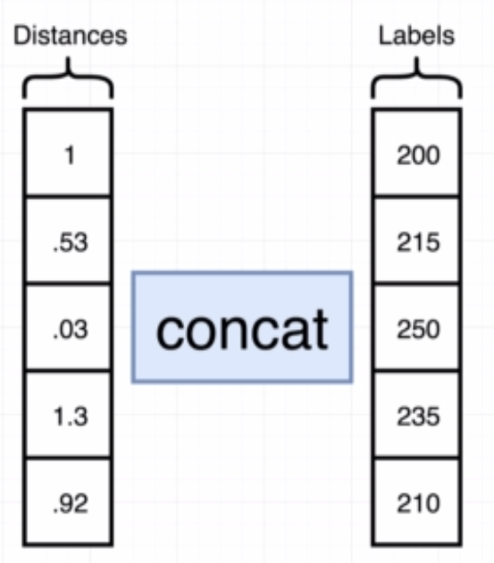
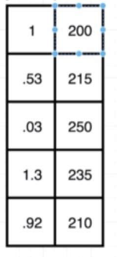
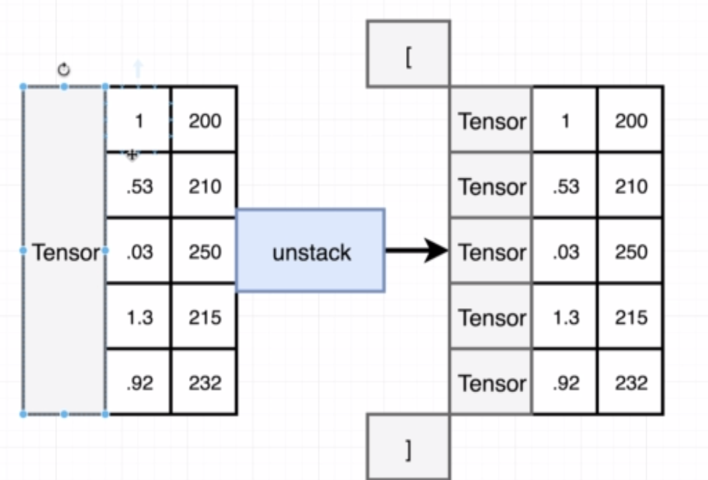

# Tensorflow JS 스터디 4주차

>부산에서 매주 진행되는 스터디입니다.
>
>부산에서 다른 스터디 내용을 보실려면 [카페](https://cafe.naver.com/busandev) 에서 보실수 있습니다.
>
><https://www.udemy.com/machine-learning-with-javascript> 을 같이 보면서 공부중입니다.

## 이전 알고리즘과 비교

- 어떤 버킷에 공을 놓을때 어떤 위치를 갈지 예측하기 -> `Classification`
  - Classification 은 예를 들어 해당 메일이 스팸인지 일반 메일인지 판별하는 문제 해결시 사용된다. 

- 주변 시세에 따른 주택 가격 예측 -> `Regression` (선형 회귀)

## 주택 가격 예측 (by `knn`)



## KNN 알고리즘

- 이번 스터디는 텐서플로를 이용해서 KNN 알고리즘 하나하나 구현해본다. 



- 특정 기능과 예측포인트 사이를 찾고
- 작은 것에서 큰걸로 정렬한다
- 최상위 K 레코드들을 가져온다. 
- 이러한 최상위 레코드들을 가져온 것에서 평균을 내서 결과값 도출한다. 

## 목표

- 위도 경도가 주어지면 House Price 가격을 주어진 데이터에 근거해서 뽑아내는 게 목표

## 준비단계



이전 내용에서는 각각 줄마다 합쳐서 테이블을 만들었다면 이번에는 두개의 `features` 와 `labels` 로 나누어서 작업을 할 예정이다.

- 가짜 데이터들을 먼저 만들도록 한다.



## 실습

> 먼저 두개의 별도의 텐서를 만든다. 하나는 위도와 경도를 저장하는 것이고 또 하나는 주택 가격을 저장한다. 

```javascript
const features = tf.tensor([
	[-121, 47],
  [-121.2, 46.5],
  [-122, 46.4],
  [-120.9, 46.7]  
]);
```

```javascript
const labels = tf.tensor([
  [200],
  [250],
  [215],
  [240]
]);
```

```javascript
const predictionPoint = tf.tensor([-121, 47]);
```

> `knn` #1 `features` 와 `predictionPoint` 와 거리를 구한다. 


거리를 구하는 방법을 텐서플로로 진행 해보자. 


이 계산식을 하나씩 풀어서 진행해볼 예정이다. 그럼 시작해보자. 

## Distance Sub


```javascript
...

features
  .sub(predictionPoint)
```

```
[[0 , 0 ], [-0.1999969, -0.5 ], [-1 , -0.5999985], [0.0999985 , -0.2999992]]
```

## 제곱


```javascript
features
  .sub(predictionPoint)
  .pow(2)
```

```
[[0 , 0 ], [0.0399988, 0.25 ], [1 , 0.3599982], [0.0099997, 0.0899995]]
```

## Sum

- 각각의 행에 대한 텐서의 값을을 합산한다.
- `Sum(0 or 1)`
  - 0의 경우 메인 축이 세로로 지정된다. 
  - 1의 경우 세로측이 메인이다. 


```javascript
features
  .sub(predictionPoint)
  .pow(2)
  .sum(0)
```

```
[1.0499985, 0.6999977]
```

우리가 원하는 가로로 계산하길 원한다. 

```javascript
features
  .sub(predictionPoint)
  .pow(2)
  .sum(0)
```

```
[0, 0.2899988, 1.3599982, 0.0999992]
```



## 제곱근



```
features
  .sub(predictionPoint)
  .pow(2)
  .sum(1)
  .pow(0.5)
```

```
[0, 0.5385153, 1.1661896, 0.3162265]
```

## 정렬

KNN 알고리즘 순서 두번째로 정렬을 진행한다. 

- 텐서들은 정렬할 수 없는 점 유의


- 거리와 라벨을 따로 떼서 정렬하면 안된다. 아래그림같이 문제가 될 수 있다.



### Concat

두개의 텐서들을 합치기 위해 `concat` 을 이용한다. 





```javascript
features
  .sub(predictionPoint)
	.pow(2)
	.sum(1)
	.pow(0.5)
	.concat(labels)
```

```
error : Error in concat1D: rank of tensors[1] must be the same as the rank of the rest (1)
```

> `shape` 들이 브로드 캐스팅을 하기 위한 조건이 아니어서 발생을 한다. 

```
labels
	.shape

features
  .sub(predictionPoint)
	.pow(2)
	.sum(1)
	.pow(0.5)
	.shape
	
..... 브로드 캐스팅 조건이 맞지 않는다.
[4,1]
[4]
```

### ExpandDims

- 부족한 줄을 채워 주기 위해 `expandDims()` 를 적용한다. 

```
features
  .sub(predictionPoint)
	.pow(2)
	.sum(1)
	.pow(0.5)
	.expandDims()

...
[[0, 0.5385153, 1.1661896, 0.3162265],]
```


한칸 더 생긴걸 볼수 있다. 

```
features
  .sub(predictionPoint)
	.pow(2)
	.sum(1)
	.pow(0.5)
	.expandDims()
	.shape
...
[1,4]
```

아직도 label 쪽과 맞지 않는다. 

- `Axis` 를 1로 해서 바꿔준다.

```
...
.expandDims(1)
	
...
[4,1]
```

이제 다시 `concat` 을 해보자

```
features
  .sub(predictionPoint)
	.pow(2)
	.sum(1)
	.pow(0.5)
	.expandDims(1)
	.concat(labels)
	
....
[[0 ], [0.5385153], [1.1661896], [0.3162265], [200 ], [250 ], [215 ], [240 ]]
```

하지만 결과를 보면 [feature,label] 순으로 합쳐 있지 않다. 

- concat 시 축을 1로 바꿔서 해보자


```
features
  .sub(predictionPoint)
	.pow(2)
	.sum(1)
	.pow(0.5)
	.expandDims(1)
	.concat(labels, 1)
	
....
[[0 , 200], [0.5385153, 250], [1.1661896, 215], [0.3162265, 240]]
```

이제 정상적으로 합쳐진걸 볼수 있다. 

하지만 아직 정렬에서 문제가 있다. 


현재 이런 구조인데 이 상태로 정렬이 안된다는 것이다. 이걸 해결하기 위해서 `unstack` 이라는 함수로 각각의 텐서로 쪼개어서 정렬할 수 있다. 

### unstack



```
features
  .sub(predictionPoint)
	.pow(2)
	.sum(1)
	.pow(0.5)
	.expandDims(1)
	.concat(labels, 1)
	.unstack()
```


각각의 텐서들로 쪼개어진 걸 볼수 있다. 

만약 특정 위치의 값을 뽑기 위해선 배열형태로 접근이 가능하다. 

```
...
.unstack()[3]
...
```

```
[0.3162265, 240]
```

### 정렬의 문제

일반 오브젝트 형태를 정렬시 동작이 안된다.  아래는 잠깐 예를 들어본다

```
const distance = [
  { value: 10 },
  { value: 30 },
  { value: 20 }
];

distance.sort()
........
[{"value":10},{"value":30},{"value":20}]
```

- sort 함수를 좀 더 확장해서 정렬을 할 수 있다.

```javascript
const distance = [
  { value: 10 },
  { value: 30 },
  { value: 20 }
];

distance.sort((a,b) => {
	return a.value > b.value ? 1 : -1
})

.......
[{"value":10},{"value":20},{"value":30}]
```

그럼 이어서 `unstack` 한 부분에 적용을 해보자. 

```
features
  .sub(predictionPoint)
	.pow(2)
	.sum(1)
	.pow(0.5)
	.expandDims(1)
	.concat(labels, 1)
	.unstack()
	.sort((a, b) => {
		a.get(0) > b.get(0) ? 1 : -1
	})
```

### 최상위 K 레코드 가져오기

정렬된 배열에서 최상위 오브젝트들을 가져오기 위해 `slice` 을 사용한다.

```javascript
const k = 2;

features
  .sub(predictionPoint)
	.pow(2)
	.sum(1)
	.pow(0.5)
	.expandDims(1)
	.concat(labels, 1)
	.unstack()
	.sort((a, b) => {
		a.get(0) > b.get(0) ? 1 : -1
	})
	.slice(0,k)
...

[{"isDisposedInternal":false,"shape":[2],"dtype":"float32","size":2,"strides":[],"dataId":{},"id":7895,"rankType":"1"},
{"isDisposedInternal":false,"shape":[2],"dtype":"float32","size":2,"strides":[],"dataId":{},"id":7897,"rankType":"1"}]
```

### 평균 구하기

#### 합계 ( reduce ) / count

```
const distance = [
  { value: 10 },
  { value: 30 },
  { value: 20 }
];

distance.reduce((acc,obj) => {
	return acc + obj.value
}, 0)

60 / 3(distance length)
.......
60 -> 20(결과)
```

위의 예제를 토대로 다시 본 소스에 적용해보자. 

```javascript
const k = 2;

features
  .sub(predictionPoint)
	.pow(2)
	.sum(1)
	.pow(0.5)
	.expandDims(1)
	.concat(labels, 1)
	.unstack()
	.sort((a, b) => {
		a.get(0) > b.get(0) ? 1 : -1
	})
	.slice(0,k)
	.reduce((acc, pair) => acc + pair.get(1), 0) / k;
	
...	
225
```

그럼 labels 기준으로 했을때 가장 근접한 수치가 `225` 로 뽑을수 있다. 

여기까지가 텐서플로을 이용해서 KNN 알고리즘을 적용하는 방법이었다. 

그럼 이제 다음 내용에는 실제 데이터를 가지고 작업을 해보자. 


