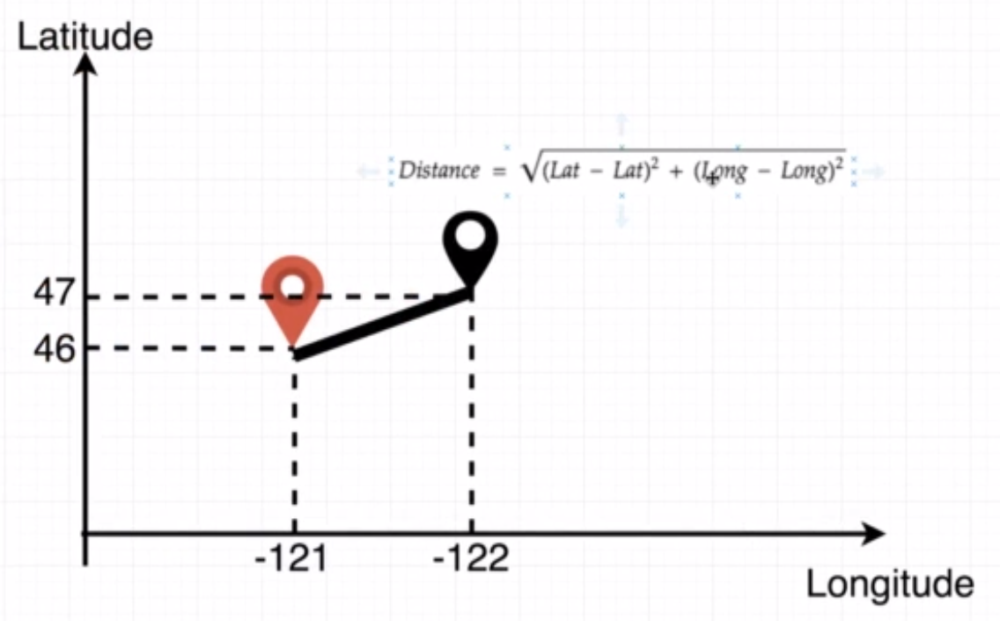
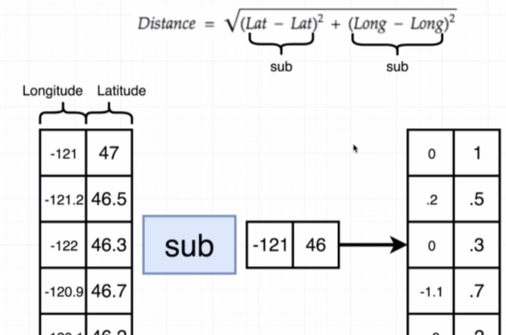
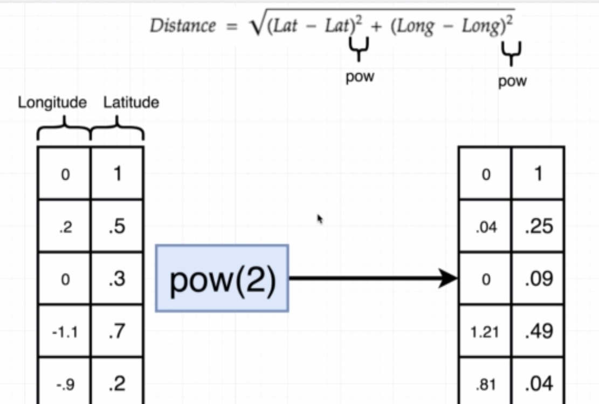
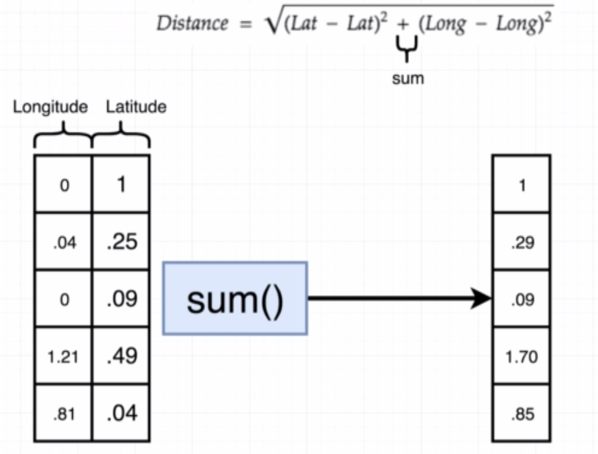
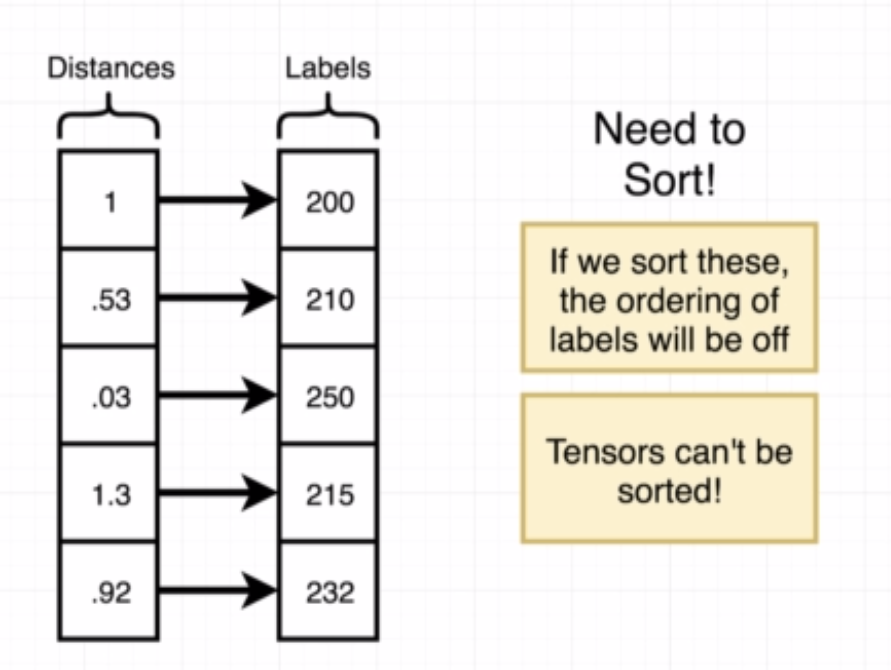
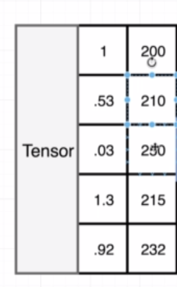
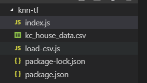
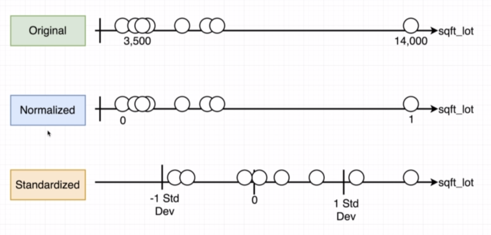

# Tensorflow JS 스터디 4주차

>부산에서 매주 진행되는 스터디입니다.
>
>부산에서 다른 스터디 내용을 보실려면 [카페](https://cafe.naver.com/busandev) 에서 보실수 있습니다.
>
><https://www.udemy.com/machine-learning-with-javascript> 을 같이 보면서 공부중입니다.

## 이전 알고리즘과 비교

- 어떤 버킷에 공을 놓을때 어떤 위치를 갈지 예측하기 -> `Classification`
  - Classification 은 예를 들어 해당 메일이 스팸인지 일반 메일인지 판별하는 문제 해결시 사용된다. 

- 주변 시세에 따른 주택 가격 예측 -> `Regression` (선형 회귀)

## 주택 가격 예측 (by `knn`)


## KNN 알고리즘

- 이번 스터디는 텐서플로를 이용해서 KNN 알고리즘 하나하나 구현해본다. 


- 특정 기능과 예측포인트 사이를 찾고
- 작은 것에서 큰걸로 정렬한다
- 최상위 K 레코드들을 가져온다. 
- 이러한 최상위 레코드들을 가져온 것에서 평균을 내서 결과값 도출한다. 

## 목표

- 위도 경도가 주어지면 House Price 가격을 주어진 데이터에 근거해서 뽑아내는 게 목표

## 준비단계


이전 내용에서는 각각 줄마다 합쳐서 테이블을 만들었다면 이번에는 두개의 `features` 와 `labels` 로 나누어서 작업을 할 예정이다.

- 가짜 데이터들을 먼저 만들도록 한다.


## 실습

> 먼저 두개의 별도의 텐서를 만든다. 하나는 위도와 경도를 저장하는 것이고 또 하나는 주택 가격을 저장한다. 

```javascript
const features = tf.tensor([
	[-121, 47],
  [-121.2, 46.5],
  [-122, 46.4],
  [-120.9, 46.7]  
]);
```

```javascript
const labels = tf.tensor([
  [200],
  [250],
  [215],
  [240]
]);
```

```javascript
const predictionPoint = tf.tensor([-121, 47]);
```

> `knn` #1 `features` 와 `predictionPoint` 와 거리를 구한다. 




거리를 구하는 방법을 텐서플로로 진행 해보자. 


이 계산식을 하나씩 풀어서 진행해볼 예정이다. 그럼 시작해보자. 

## Distance Sub




```javascript
...

features
  .sub(predictionPoint)
```

```
[[0 , 0 ], [-0.1999969, -0.5 ], [-1 , -0.5999985], [0.0999985 , -0.2999992]]
```

## 제곱



```javascript
features
  .sub(predictionPoint)
  .pow(2)
```

```
[[0 , 0 ], [0.0399988, 0.25 ], [1 , 0.3599982], [0.0099997, 0.0899995]]
```

## Sum

- 각각의 행에 대한 텐서의 값을을 합산한다.
- `Sum(0 or 1)`
  - 0의 경우 메인 축이 세로로 지정된다. 
  - 1의 경우 세로측이 메인이다. 



```javascript
features
  .sub(predictionPoint)
  .pow(2)
  .sum(0)
```

```
[1.0499985, 0.6999977]
```

우리가 원하는 가로로 계산하길 원한다. 

```javascript
features
  .sub(predictionPoint)
  .pow(2)
  .sum(0)
```

```
[0, 0.2899988, 1.3599982, 0.0999992]
```


## 제곱근


```
features
  .sub(predictionPoint)
  .pow(2)
  .sum(1)
  .pow(0.5)
```

```
[0, 0.5385153, 1.1661896, 0.3162265]
```

## 정렬

KNN 알고리즘 순서 두번째로 정렬을 진행한다. 

- 텐서들은 정렬할 수 없는 점 유의



- 거리와 라벨을 따로 떼서 정렬하면 안된다. 아래그림같이 문제가 될 수 있다.


### Concat

두개의 텐서들을 합치기 위해 `concat` 을 이용한다. 


```javascript
features
  .sub(predictionPoint)
	.pow(2)
	.sum(1)
	.pow(0.5)
	.concat(labels)
```

```
error : Error in concat1D: rank of tensors[1] must be the same as the rank of the rest (1)
```

> `shape` 들이 브로드 캐스팅을 하기 위한 조건이 아니어서 발생을 한다. 

```
labels
	.shape

features
  .sub(predictionPoint)
	.pow(2)
	.sum(1)
	.pow(0.5)
	.shape
	
..... 브로드 캐스팅 조건이 맞지 않는다.
[4,1]
[4]
```

### ExpandDims

- 부족한 줄을 채워 주기 위해 `expandDims()` 를 적용한다. 

```
features
  .sub(predictionPoint)
	.pow(2)
	.sum(1)
	.pow(0.5)
	.expandDims()

...
[[0, 0.5385153, 1.1661896, 0.3162265],]
```


한칸 더 생긴걸 볼수 있다. 

```
features
  .sub(predictionPoint)
	.pow(2)
	.sum(1)
	.pow(0.5)
	.expandDims()
	.shape
...
[1,4]
```

아직도 label 쪽과 맞지 않는다. 

- `Axis` 를 1로 해서 바꿔준다.

```
...
.expandDims(1)
	
...
[4,1]
```

이제 다시 `concat` 을 해보자

```
features
  .sub(predictionPoint)
	.pow(2)
	.sum(1)
	.pow(0.5)
	.expandDims(1)
	.concat(labels)
	
....
[[0 ], [0.5385153], [1.1661896], [0.3162265], [200 ], [250 ], [215 ], [240 ]]
```

하지만 결과를 보면 [feature,label] 순으로 합쳐 있지 않다. 

- concat 시 축을 1로 바꿔서 해보자


```
features
  .sub(predictionPoint)
	.pow(2)
	.sum(1)
	.pow(0.5)
	.expandDims(1)
	.concat(labels, 1)
	
....
[[0 , 200], [0.5385153, 250], [1.1661896, 215], [0.3162265, 240]]
```

이제 정상적으로 합쳐진걸 볼수 있다. 

하지만 아직 정렬에서 문제가 있다. 



현재 이런 구조인데 이 상태로 정렬이 안된다는 것이다. 이걸 해결하기 위해서 `unstack` 이라는 함수로 각각의 텐서로 쪼개어서 정렬할 수 있다. 

### unstack


```
features
  .sub(predictionPoint)
	.pow(2)
	.sum(1)
	.pow(0.5)
	.expandDims(1)
	.concat(labels, 1)
	.unstack()
```


각각의 텐서들로 쪼개어진 걸 볼수 있다. 

만약 특정 위치의 값을 뽑기 위해선 배열형태로 접근이 가능하다. 

```
...
.unstack()[3]
...
```

```
[0.3162265, 240]
```

### 정렬의 문제

일반 오브젝트 형태를 정렬시 동작이 안된다.  아래는 잠깐 예를 들어본다

```
const distance = [
  { value: 10 },
  { value: 30 },
  { value: 20 }
];

distance.sort()
........
[{"value":10},{"value":30},{"value":20}]
```

- sort 함수를 좀 더 확장해서 정렬을 할 수 있다.

```javascript
const distance = [
  { value: 10 },
  { value: 30 },
  { value: 20 }
];

distance.sort((a,b) => {
	return a.value > b.value ? 1 : -1
})

.......
[{"value":10},{"value":20},{"value":30}]
```

그럼 이어서 `unstack` 한 부분에 적용을 해보자. 

```
features
  .sub(predictionPoint)
	.pow(2)
	.sum(1)
	.pow(0.5)
	.expandDims(1)
	.concat(labels, 1)
	.unstack()
	.sort((a, b) => {
		a.get(0) > b.get(0) ? 1 : -1
	})
```

### 최상위 K 레코드 가져오기

정렬된 배열에서 최상위 오브젝트들을 가져오기 위해 `slice` 을 사용한다.

```javascript
const k = 2;

features
  .sub(predictionPoint)
	.pow(2)
	.sum(1)
	.pow(0.5)
	.expandDims(1)
	.concat(labels, 1)
	.unstack()
	.sort((a, b) => {
		a.get(0) > b.get(0) ? 1 : -1
	})
	.slice(0,k)
...

[{"isDisposedInternal":false,"shape":[2],"dtype":"float32","size":2,"strides":[],"dataId":{},"id":7895,"rankType":"1"},
{"isDisposedInternal":false,"shape":[2],"dtype":"float32","size":2,"strides":[],"dataId":{},"id":7897,"rankType":"1"}]
```

### 평균 구하기

#### 합계 ( reduce ) / count

```
const distance = [
  { value: 10 },
  { value: 30 },
  { value: 20 }
];

distance.reduce((acc,obj) => {
	return acc + obj.value
}, 0)

60 / 3(distance length)
.......
60 -> 20(결과)
```

위의 예제를 토대로 다시 본 소스에 적용해보자. 

```javascript
const k = 2;

features
  .sub(predictionPoint)
	.pow(2)
	.sum(1)
	.pow(0.5)
	.expandDims(1)
	.concat(labels, 1)
	.unstack()
	.sort((a, b) => {
		a.get(0) > b.get(0) ? 1 : -1
	})
	.slice(0,k)
	.reduce((acc, pair) => acc + pair.get(1), 0) / k;
	
...	
225
```

그럼 labels 기준으로 했을때 가장 근접한 수치가 `225` 로 뽑을수 있다. 

여기까지가 텐서플로을 이용해서 KNN 알고리즘을 적용하는 방법이었다. 

그럼 이제 다음 내용에는 실제 데이터를 가지고 작업을 해보자. 

## 소스 준비

```
git clone https://github.com/StephenGrider/MLKits.git
git checkout 84f617c4549409c104aa994465101d1a8fd164e2

npm install
```



### index.js

이제 위에서 공부했던 내용을 코드로 옮겨보자.

기본적으로 모듈은 두개를 설치를 한다. 

```javascript
require('@tensorflow/tfjs-node');
// 만약 gpu 를 사용시 tfjs-node-gpu 적용
const tf = require('@tensorflow/tfjs');
```

### load csv file

이미 준비된 데이터를 이용한다. 

```javascript
require('@tensorflow/tfjs-node');
const tf = require('@tensorflow/tfjs');
const loadCSV = require('./load-csv');

let { features, labels, testFeatures, testLabels } = loadCSV('kc_house_data.csv', {
    // 무작위로 섞기
    shuffle: true,
    // 테스트셋 지정 -> testfeatures, testlabels
    splitTest: 10,
    // features 지정 (위도, 경도) -> features
    dataColumns: ['lat', 'long'],
    // price 지정 -> label
    labelColumns: ['price'],    
});

console.log(testFeatures);
console.log(testLabels);
```

```
[ [ 47.561, -122.226 ],
  [ 47.6595, -122.186 ],
  [ 47.5081, -122.093 ],
  [ 47.5276, -122.161 ],
  [ 47.6695, -122.333 ],
  [ 47.6769, -122.36 ],
  [ 47.5442, -122.141 ],
  [ 47.699, -122.206 ],
  [ 47.3196, -122.399 ],
  [ 47.2843, -122.357 ] ]
[ [ 1085000 ],
  [ 466800 ],
  [ 425000 ],
  [ 565000 ],
  [ 759000 ],
  [ 512031 ],
  [ 768000 ],
  [ 1532500 ],
  [ 204950 ],
  [ 247000 ] ]
```

### Tensorflow JS 작성

```javascript
function knn(features, labels, predictionPoint, k) {
    return features
        .sub(predictionPoint)
        .pow(2)
        .sum(1)
        .pow(0.5)
        .expandDims(1)
        .concat(labels, 1)
        .unstack()
        .sort((a, b) => {
            a.get(0) > b.get(0) ? 1 : -1
        })
        .slice(0, k)
        .reduce((acc, pair) => acc + pair.get(1), 0) / k;
}
```

### knn 함수 적용

- `변수들을 텐서로 변환해서 사용해야 한다`

```javascript
features = tf.tensor(features);
labels = tf.tensor(labels);
testFeatures = tf.tensor(testFeatures);
testLabels = tf.tensor(testLabels);
```

- 하나의 값만 우선 테스팅 하기 위해 `testFeatures[0]` 으로 가져온다. 

```javascript
const result = knn(features, labels, tf.tensor(testFeatures[0]), 10);
console.log('Guess', result, testLabels[0][0]);

.....
Guess 559100 1085000
```

하지만 `559100` `1085000` 두개의 값이 가격 차이가 너무 나는 걸 볼 수 있다. 

이걸 다시 개선하는 방법에 대해서 공부해보자. 

### 정확도

- 우선 에러가 작을수록 좋다. 이걸 측정해보자.


위의 공식을 코드로 구현하면 다음과 같다.

```javascript
const err = (testLabels[0][0] - result) / testLabels[0][0];
console.log('Err', err * 100);

.......
Err 48.47004608294931
```

약 48프로 정도 에러가 발생하고 있다. 

그럼 전체 testFeatures 에 대해 불정확률을 구해보면

```javascript
testFeatures.forEach((testPoint, i) => {
    const result = knn(features, labels, tf.tensor(testPoint), 10);
    const err = (testLabels[i][0] - result) / testLabels[i][0];
    console.log('Err', err * 100);
});

....
Err 48.47004608294931
Err -19.77292202227935
Err -31.55294117647059
Err 1.0442477876106195
Err 26.337285902503293
Err -9.192607478844055
Err 27.200520833333336
Err 63.51712887438825
Err -172.79824347401805
Err -126.35627530364373
```

이러한 내용에 좀 더 정확도를 올리기 위해 좀 더 추가적인 `features` 를 추가해본다. 

- `sqft_lot` : 평방 피트

```
let { features, labels, testFeatures, testLabels } = loadCSV('kc_house_data.csv', {
    // 무작위로 섞기
    shuffle: true,
    // 테스트셋 지정 -> testfeatures, testlabels
    splitTest: 10,
    // features 지정 (위도, 경도) -> features
    dataColumns: ['lat', 'long', 'sqft_lot'],
    // price 지정 -> label
    labelColumns: ['price'],
});
```

### 표준화

처음에 배웠던 내용중에 normalize 하는 방법에 대해서 공부를 했었다. 


>  표준화 하는 과정


이 방법을 지금 내용에 도입해보자. 

- 중간에 너무 범위가 커서 제대로된 표준화가 힘들어 보이는 문제점이 있다



이 부분을 해결하기 위해서 새로운 함수를 적용시켜 보자. 

- `StandartDeviation` : 표준편차


### moments

tensorflowjs 에는  함수를 제공 한다. => `moments`

예시를 들어보자. 

```
const numbers = tf.tensor([
	[1, 2],
  [3, 4],
  [5, 6]
]);

tf.moments(numbers);

....
{"mean":{"isDisposedInternal":false,"shape":[],"dtype":"float32","size":1,"strides":[],"dataId":{},"id":41,"rankType":"0"},"variance":{"isDisposedInternal":false,"shape":[],"dtype":"float32","size":1,"strides":[],"dataId":{},"id":50,"rankType":"0"}}
```

우리는 여기에서 `mean` 과 `variance` 를 사용할 수 있다.

- `average` : `mean`

- `value` : `numbers`
- `StandartDeviation` :  `sqrt(variance)`


```
const numbers = tf.tensor([
  [1, 2],
  [3, 4],
  [5, 6]
]);

// 0은 축을 바꿔서 계산한다.
const { mean, variance} = tf.moments(numbers, 0);

numbers.sub(mean).div(variance.pow(.5))

.........
[[-1.2247449, -1.2247449], [0 , 0 ], [1.2247449 , 1.2247449 ]]
```

이제 본 소스에 적용해보자. 

```javascript
function knn(features, labels, predictionPoint, k) {
    const { mean, variance } = tf.moments(features, 0);

    const scaledPrediction = predictionPoint.sub(mean).div(variance.pow(0.5))

    return features
        .sub(mean)
        .div(variance.pow(0.5))
        .sub(scaledPrediction)
        .pow(2)
        .sum(1)
        .pow(0.5)
        .expandDims(1)
        .concat(labels, 1)
        .unstack()
        .sort((a, b) => {
            a.get(0) > b.get(0) ? 1 : -1
        })
        .slice(0, k)
        .reduce((acc, pair) => acc + pair.get(1), 0) / k;
}
```

```
Error -15.323502304147466
Error -11.344580119965723
Error -2.047058823529412
Error 19.327433628318584
Error 7.806324110671936
Error -14.106372465729613
Error -8.782552083333334
Error 13.227406199021207
Error -36.336911441815076
Error 7.381578947368421
```

30프로정도 확률안에서 도는 정도까지 수정했다. 

이 보다 정확도를 올리는 방법은 두가지가 있다. 

- `testFeatures` 수를 좀 더 수를 늘리거나
- 훈련수를 늘리거나

이건 다음 알고리즘 수업을 통해서 공부를 해보자.

## 전체 소스

```javascript
require('@tensorflow/tfjs-node');
const tf = require('@tensorflow/tfjs');
const loadCSV = require('./load-csv');

function knn(features, labels, predictionPoint, k) {
  const { mean, variance } = tf.moments(features, 0);

  const scaledPrediction = predictionPoint.sub(mean).div(variance.pow(0.5));

  return (
    features
      .sub(mean)
      .div(variance.pow(0.5))
      .sub(scaledPrediction)
      .pow(2)
      .sum(1)
      .pow(0.5)
      .expandDims(1)
      .concat(labels, 1)
      .unstack()
      .sort((a, b) => (a.get(0) > b.get(0) ? 1 : -1))
      .slice(0, k)
      .reduce((acc, pair) => acc + pair.get(1), 0) / k
  );
}

let { features, labels, testFeatures, testLabels } = loadCSV(
  'kc_house_data.csv',
  {
    shuffle: true,
    splitTest: 10,
    dataColumns: ['lat', 'long', 'sqft_lot', 'sqft_living'],
    labelColumns: ['price']
  }
);

features = tf.tensor(features);
labels = tf.tensor(labels);

testFeatures.forEach((testPoint, i) => {
  const result = knn(features, labels, tf.tensor(testPoint), 10);
  const err = (testLabels[i][0] - result) / testLabels[i][0];
  console.log('Error', err * 100);
});
```


