# HTML + CSS 스터디 1주차 스터디 정리내용 #2

> 부산에서 매주 진행되는 CSS 초중급 스터디입니다. 
>
> 더 많은 스터디는 [네이버 카페](https://cafe.naver.com/busandev)에서 확인 부탁드립니다. 

저번 시간은 [Flex](http://javaexpert.tistory.com/991) 에 대해서 공부했다. 

Flex로 화면 배치 하는데 불편함이 다소 있다. 그래서 Css Grid 라는 게 나왔다. 

CSS Grid 에 대해서 하나씩 정리해보도록 하겠다. 

이 내용은 [니콜라스님의 CSS 마스터 클래스](https://academy.nomadcoders.co)를 공부하고 정리한 글이다. 

## CSS Grid 가 필요한 이유?

우선 FlexBox 가 부족한 부분이 뭔지 살펴보자. 

만약 여러개의 박스가 들어올 경우 overflow 되면서 배치가 되기 때문에 보기가 안좋을 수 있다. 

`CSS Grid System` 이라고 하는 테이블같은 걸 쉽게 짤 수 있도록 도와준다. 

## CSS Grid Basic

`Grid 시스템`은 가로 세로를 지정해서 가능하다. 

예를 들어보자. 하나의 박스를 `가로 30px, 세로 30px` 으로 지정해서 만들수 있다. 

```html
<html lang="en">
<head>
    <meta charset="UTF-8">
    <meta name="viewport" content="width=device-width, initial-scale=1.0">
    <meta http-equiv="X-UA-Compatible" content="ie=edge">
    <title>Document</title>
    <style>
        .father {
            display: grid;
            grid-template-columns: 30px 50px;
            grid-template-rows: 30px 12px;
        }

        .box {
            background-color: #f1c40f;
        }
    </style>
</head>
<body>
    <div class="father">
        <div class="box"></div>
        <div class="box"></div>
        <div class="box"></div>
        <div class="box"></div>
        <div class="box"></div>
    </div>
</body>
</html>
```


## Grid 기능

### Grid-template-rows, Grid-template-columns

만약 여러개로 만든다고 하면 다음과 같이 가능하다. 

- `30x30`
- `50x30`
- `30x12`
- `50x12`

```html
<html lang="en">
<head>
    <meta charset="UTF-8">
    <meta name="viewport" content="width=device-width, initial-scale=1.0">
    <meta http-equiv="X-UA-Compatible" content="ie=edge">
    <title>Document</title>
    <style>
        .father {
            display: grid;
            grid-template-columns: 30px 50px;
            grid-template-rows: 30px 12px;
            grid-gap: 5px;
        }

        .box {
            background-color: #f1c40f;
        }
    </style>
</head>
<body>
    <div class="father">
        <div class="box"></div>
        <div class="box"></div>
        <div class="box"></div>
        <div class="box"></div>
        <div class="box"></div>
    </div>
</body>
</html>
```

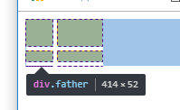

### Grid-auto-rows

`grid-template-columns` 에 지정된 수를 초과하는 경우 높이를 지정할 수 있다. 

- `Grid-auto-columns` 반대되는 의미로 사용가능하다.

```css
        .father {
            display: grid;
            grid-template-columns: 30px 50px;
            grid-template-rows: 30px 12px;
            grid-gap: 5px;
            grid-auto-rows: 60px;
        }
```

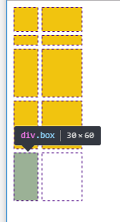

### Grid-auto-flow

`grid-auto-columns` 나 `grid-auto-rows` 사용시 진행되는 배치를 뜻한다. row 나 column 을 지정 가능하다. 

`flex-direction` 과 비슷한 개념이라고 보면 된다. 

### Grid-template-ares **

문자열로 템플릿을 정한다음 하위 css에 속성을 하나씩 지정해줌

- 문자열로 템플릿 구성

```html
<html lang="en">

<head>
    <meta charset="UTF-8">
    <meta name="viewport" content="width=device-width, initial-scale=1.0">
    <meta http-equiv="X-UA-Compatible" content="ie=edge">
    <title>Document</title>
    <style>
        .father {
            display: grid;
            grid-auto-rows: 200px;
            grid-gap: 5px;
            grid-template-areas: "header header header"
                "content content sidebar"
                "content content sidebar"
                "footer footer footer"
        }

        .first {
            grid-area: header;
            background-color: #f1c40f;
        }

        .second {
            grid-area: sidebar;
            background-color: #27ae60;
        }

        .third {
            grid-area: footer;
            background-color: #3498db;
        }

        .fourth {
            grid-area: content;
            background-color: #d35400;
        }
    </style>
</head>

<body>
    <div class="father">
        <div class="first"></div>
        <div class="second"></div>
        <div class="third"></div>
        <div class="fourth"></div>
    </div>
</body>

</html>
```

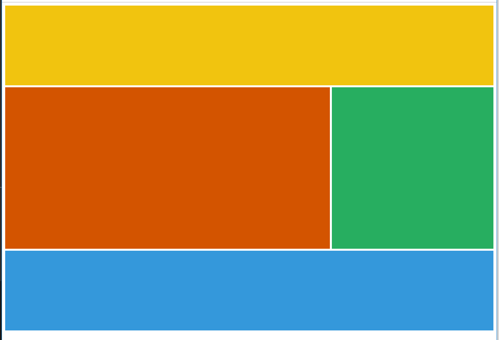

### fr and repeate()

#### fr

> `fr = fraction` : 가능한 최대 넓이를 가지자

반응형을 제작시 계산이 필요하지 않는 경우가 많다. 예를 들어 분할해서 균등하게 넣고 싶다던지 하는..

그럴경우 `fr` 로 사용 가능하다. 

우선 적용전 화면을 살펴보자.

```css
    <style>
        .father {
            display: grid;
            grid-auto-rows: 200px;
            grid-gap: 5px;            
        }

        .first {            
            background-color: #f1c40f;
        }

        .second {            
            background-color: #27ae60;
        }

        .third {            
            background-color: #3498db;
        }

        .fourth {            
            background-color: #d35400;
        }
    </style
```

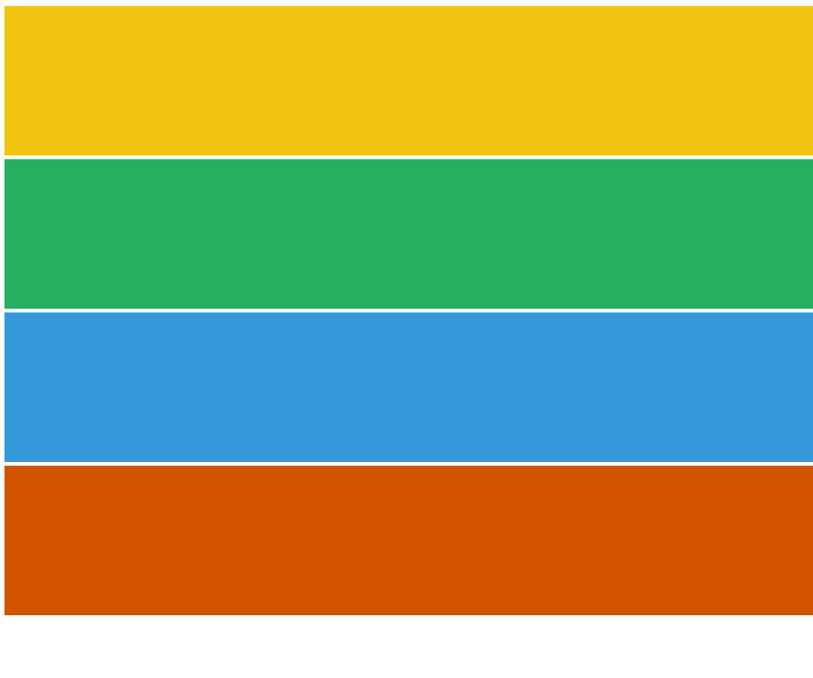

위 내용처럼 배치되어있다고 하자. 만약 1,3번째 컬럼을 2,4번째 컬럼보다 2배로 넓었으면 좋을 경우 어떻게 해야 할까?

- `grid-template-columns: 2fr 1fr 2fr 1fr;` 

```css
        .father {
            display: grid;
            grid-auto-rows: 200px;
            grid-gap: 5px;          
            grid-template-columns: 2fr 1fr 2fr 1fr;  
        }
```


이런식으로 2배 넓이를 줄 수 있다. 

#### repeat

> 반복적으로 `fr` 로 단위를 줄 수 있다. 

```css
.father {
    display: grid;
    grid-auto-rows: 200px;
    grid-gap: 5px;          
    grid-template-columns: repeat(4, 1fr);  
}
```


부가적으로 `fr` 을 추가적으로 설정도 가능하다. 

```css
...
grid-template-columns: repeat(3, 1fr) 4fr;  
...
```


### minmax,max-content,min-content

#### minmax

> `minmax` 는 object의 `maximum`과 `minimum` 크기를 지정해주는 도구

```css
...
grid-template-columns: minmax(400px, 2fr) repeat(3, 1fr);  
...
```

줄어들더라도 첫번째 콘테이너는 최소로 유지되는 걸 볼수 있다. 


#### maxcontent

> 내부에 있는 content를 기반으로 최대 크기를 정하는 게 `max-content` 의 핵심

```css
grid-template-columns: max-content repeat(3, 1fr);  
```


#### mincontent

> 내부에 있는 `content`를 최소 크기만큼만 확보하는게 `mincontent`

```css
grid-template-columns: min-content repeat(3, 1fr);  
```


### auto-fill, auto-fit

#### auto-fit

우선 여러개의 `grid`를 만들었다고 가정하자. 

```css
<html lang="en">

<head>
    <meta charset="UTF-8">
    <meta name="viewport" content="width=device-width, initial-scale=1.0">
    <meta http-equiv="X-UA-Compatible" content="ie=edge">
    <title>Document</title>
    <style>
        .father {
            display: grid;            
            grid-gap: 10px;
            grid-auto-rows: 100px;          
            grid-template-columns: repeat(4, 1fr);  
        }

        .box:nth-child(even) {
            background-color: #3498db;            
        }

        .box:nth-child(odd) {
            background-color: #34495e;
        }
    </style>
</head>

<body>
    <div class="father">
        <div class="box"></div>
        <div class="box"></div>
        <div class="box"></div>
        <div class="box"></div>
        <div class="box"></div>
        <div class="box"></div>
        <div class="box"></div>
        <div class="box"></div>
        <div class="box"></div>
        <div class="box"></div>
        <div class="box"></div>
        <div class="box"></div>
        <div class="box"></div>
        <div class="box"></div>
        <div class="box"></div>
        <div class="box"></div>
        <div class="box"></div>
        <div class="box"></div>
        <div class="box"></div>
        <div class="box"></div>
    </div>
</body>

</html>
```


만약 각각의 아이템을 꽉 차게 배치를 하고 싶다고 하면 어떻게 해야 할까?

그럴때 `auto-fit` 으로 구성할 수 있다. 

```css
grid-template-columns: repeat(auto-fit, 1fr);
```


```css
grid-template-columns: repeat(auto-fit, 50px);
```


```css
grid-template-columns: repeat(auto-fit, 340px);	
```


하지만 공간이 부족할 경우 오른쪽 빨간 박스 처럼 빈공간을 보여주고 하단으로 내려가게 된다. 

이걸 방지하기 위해 이전에 공부한 `minmax` 를 적용하면 채울수 있다.

```css
grid-template-columns: repeat(auto-fit, minmax(350px, 1fr));
```

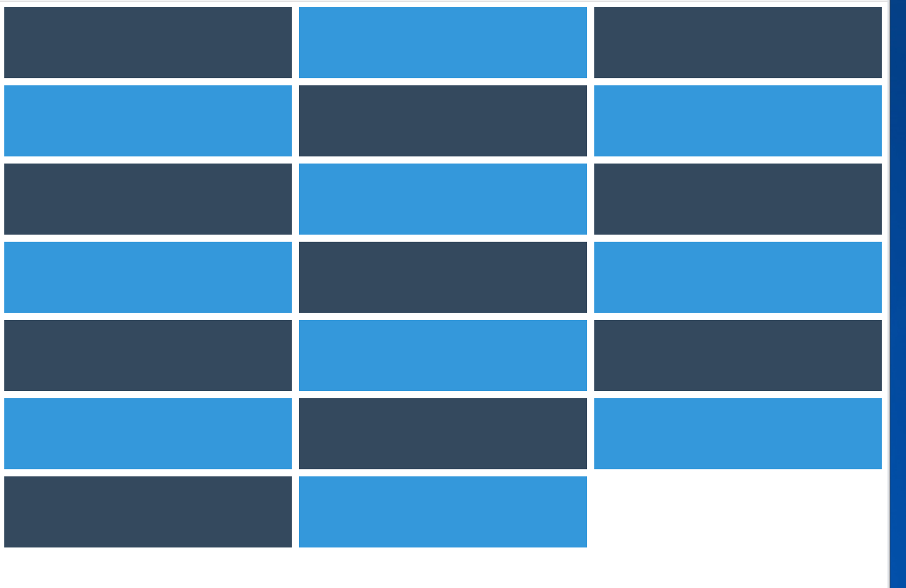

#### auto-fill

> 콘텐트가 없다고 해도 레이아웃을 다 채울수 있다. `ghost-grid`로 나머지 부분을 채우는 걸 뜻한다. 

```css
grid-template-columns: repeat(auto-fill, minmax(50px, 1fr));  
```


> `auto-fit` 과 `auto-fill` 차이점은 `ghost-grid` 가 있는지 없는지이다.

### justify content, Align content, Place content

> 이전에 배운 `Flex` 에서 비슷한 속성이 있다. 

```html
<html lang="en">

<head>
    <meta charset="UTF-8">
    <meta name="viewport" content="width=device-width, initial-scale=1.0">
    <meta http-equiv="X-UA-Compatible" content="ie=edge">
    <title>Document</title>
    <style>
        .father {
            display: grid;            
            grid-gap: 10px;
            grid-auto-rows: 100px;          
            grid-template-columns: repeat(5, 100px);
            color: white;
        }

        .box:nth-child(even) {
            background-color: #3498db;            
        }

        .box:nth-child(odd) {
            background-color: #34495e;
        }
    </style>
</head>

<body>
    <div class="father">
        <div class="box">1</div>
        <div class="box">2</div>
        <div class="box">3</div>
        <div class="box">4</div>
        <div class="box">5</div>
    </div>
</body>

</html>
```


이런 형태가 있다고 하자. 

#### justify content

```css
justify-content: center;
```


이런식으로 중앙으로 이동을 한다. 

> `start`,`end` 로 설정가능하다. 

#### align content

```
align-content: center;
height: 100vh;
```


> grid 에서도 `justify content` 는 가로축을 뜻하며 `align conent`는 세로축을 뜻한다. 

#### Place content

`justify conent` 와 `align content` 두개를 합쳐서 설정할 수 있는 속성이다. 

```css
place-content: center end;
```

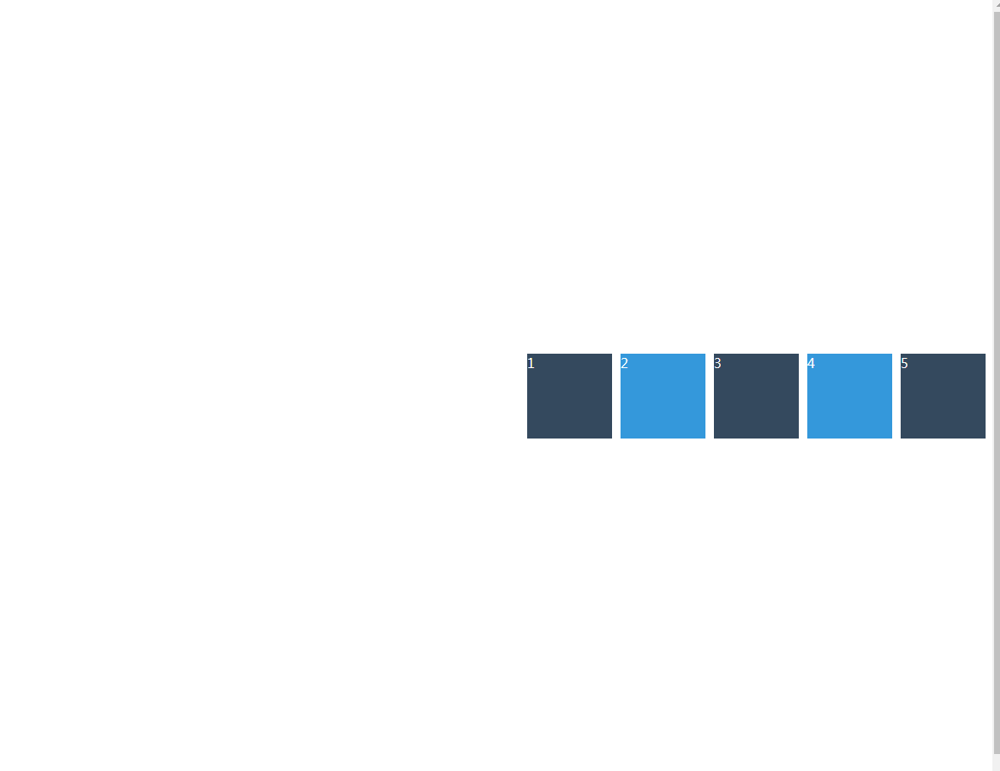

> 즉 첫번째 인자는 `align content` 가 들어가고 두번째 인자는 `justify content` 가 들어간다. 

### justify items, align items, place items

#### justify items

> 콘텐트가 아닌 내용을 안에 위치 시킨다. 

```css
        .father {
            display: grid;            
            grid-gap: 10px;
            grid-auto-rows: 100px;          
            grid-template-columns: repeat(5, 100px);
            color: white;            
            height: 100vh;
            justify-items: center;
        }
```


```css
justify-items: center;
```


>  주의 할점은 외부적으로 컨테이너가 있고 내부적으로만 움직이는 것이다.


#### align items

```css
align-items: start;
```


#### place items

> `align items` 와 `justify items` 를 혼합해서 사용 가능하다.

```
place-items: end center; 
```


### Grid column, Row Start and End

#### Grid + Flex 혼합해서 사용

```css
<html lang="en">

<head>
    <meta charset="UTF-8">
    <meta name="viewport" content="width=device-width, initial-scale=1.0">
    <meta http-equiv="X-UA-Compatible" content="ie=edge">
    <title>Document</title>
    <style>
        .father {
            display: grid;            
            grid-gap: 10px;
            grid-auto-rows: 100px;          
            grid-template-columns: repeat(5,1fr);            
        }

        .box {
            display: flex;
            align-items: center;
            justify-content: center;
            color: white;
        }

        .box:nth-child(even) {
            background-color: #3498db;            
        }

        .box:nth-child(odd) {
            background-color: #34495e;
        }
    </style>
</head>

<body>
    <div class="father">
        <div class="box">1</div>
        <div class="box">2</div>
        <div class="box">3</div>
        <div class="box">4</div>
        <div class="box">5</div>
        <div class="box">6</div>
        <div class="box">7</div>
        <div class="box">8</div>
        <div class="box">9</div>
        <div class="box">10</div>
        <div class="box">11</div>
        <div class="box">12</div>
        <div class="box">13</div>
        <div class="box">14</div>
        <div class="box">15</div>
    </div>
</body>

</html>
```


위와 같은 이미지에서 만약 1,2 를 합치고 싶은 경우를 생각해보자. 

#### Grid Columns

> `Row Start / Row End`

```css
        .box:first-child {
            grid-column: 1/3;
        }
```

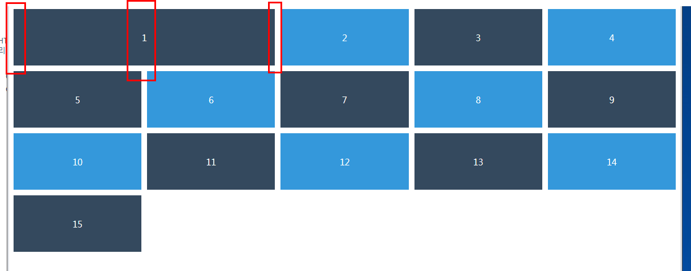

대체해서 이런식으로도 사용 가능하다. 

```css
.box:first-child {
    grid-column-start: 1;
    grid-column-end: 5;
}
```

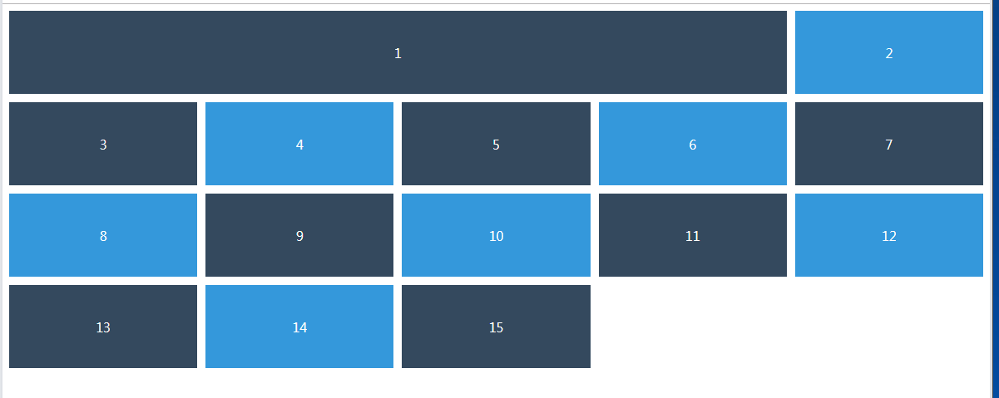

> `end ` 에 -1 을 적용시 끝까지 적용된다. 

```
grid-column-end: -1;
```


### Line Naming and Grid-auto-flow

#### Line naming

이전에 배운 grid-column 에 이름을 붙여서 확장이 가능하다. 

```css
    <style>
        .father {
            display: grid;            
            grid-gap: 10px;
            grid-auto-rows: 100px;          
            grid-template-columns: 
                [first-line] 1fr 
                [awesome-line] 1fr 
                [sexy-line] 1fr 
                [third-line] 1fr 
                [fourth-line] 1fr 
                [line-line];
        }

        .box {
            display: flex;
            align-items: center;
            justify-content: center;
            color: white;
        }

        .box:nth-child(even) {
            background-color: #3498db;            
        }

        .box:nth-child(odd) {
            background-color: #34495e;
        }

        .box:first-child {
            grid-column-start: sexy-line;
            grid-column-end: fourth-line;
        }
    </style>
```

> `sexy-line` 부터 `fourth-line` 까지 확장하는 걸 뜻한다. 


추가적으로 `repeat` 를 붙여서 사용도 가능하다. 

```css
        .father {
            display: grid;            
            grid-gap: 10px;
            grid-auto-rows: 100px;          
            grid-template-columns: [first-line] repeat(5, 1fr) [last-line];
                
        }

        .box:first-child {
            grid-column-start: first-line;
            grid-column-end: last-line;
        }
```

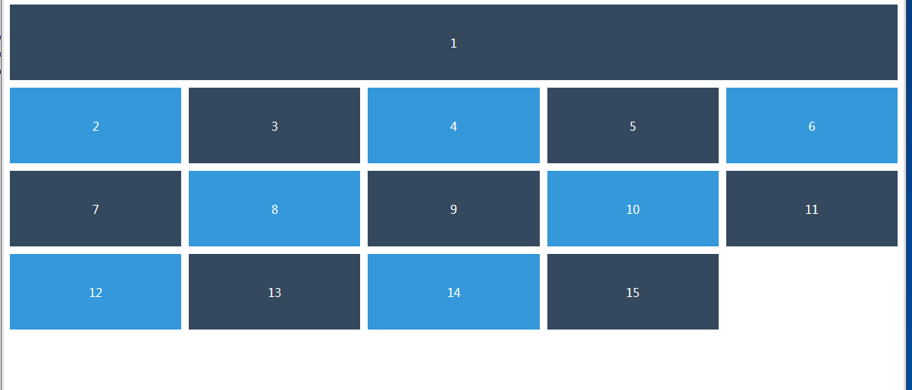

#### grid-auto-flow


보시다 시피 1 번 앞에 2개가 비어 있다. 이럴경우 `밑에 3,4번을 위로 올려서` 채우길 원할 수 있다. 

이럴경우 `grid-auto-flow` 를 사용할 수 있다. 

>  `grid-auto-flow` 를 `row dense` 으로 채울수 있다. 

```css
.father {
        display: grid;            
        grid-gap: 10px;
        grid-auto-rows: 100px;  
        grid-auto-flow: row dense;        
        grid-template-columns: 
        [first-line] 1fr 
        [awesome-line] 1fr 
        [sexy-line] 1fr 
        [third-line] 1fr 
        [fourth-line] 1fr 
        [line-line];
}
```


### Grid Row, Row Start and End

>  만약 `start` 와 `end` 를 넣기에 애매한 경우 `span` 으로 이용가능하다. 

```css
        .box:first-child {
            grid-row: span 3;
            grid-column: span 3;
        }
		
```

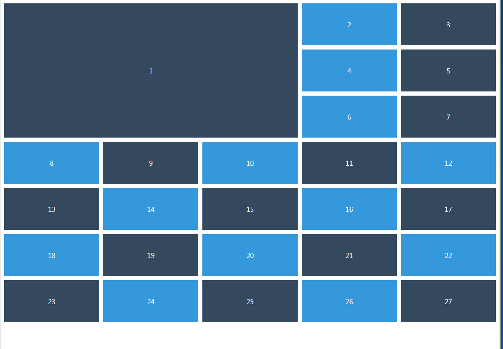

화면을 축소해도 1은 유지를 한다. 

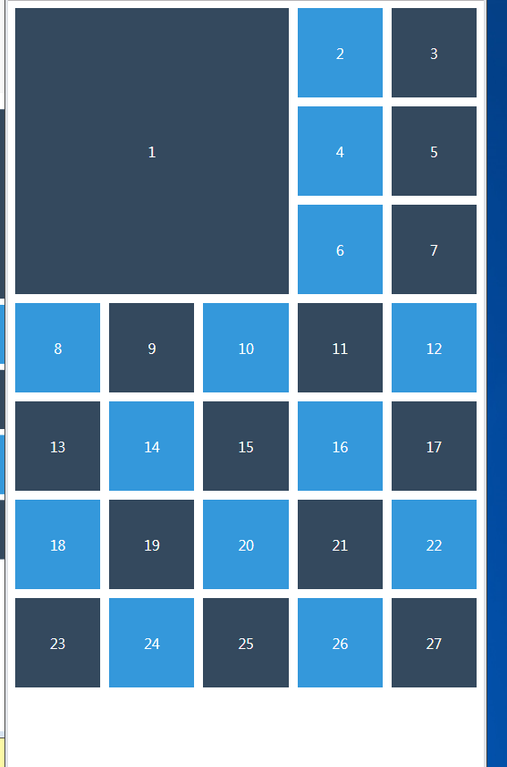

### Grid Area

Grid Area 로 편하게 위치를 지정 할 수 있다. 

> `row start`, `column start`, `row end`, `column end`

```
        .box:first-child {
            grid-area: 2 / 1 / 4 / -1;
        }
```

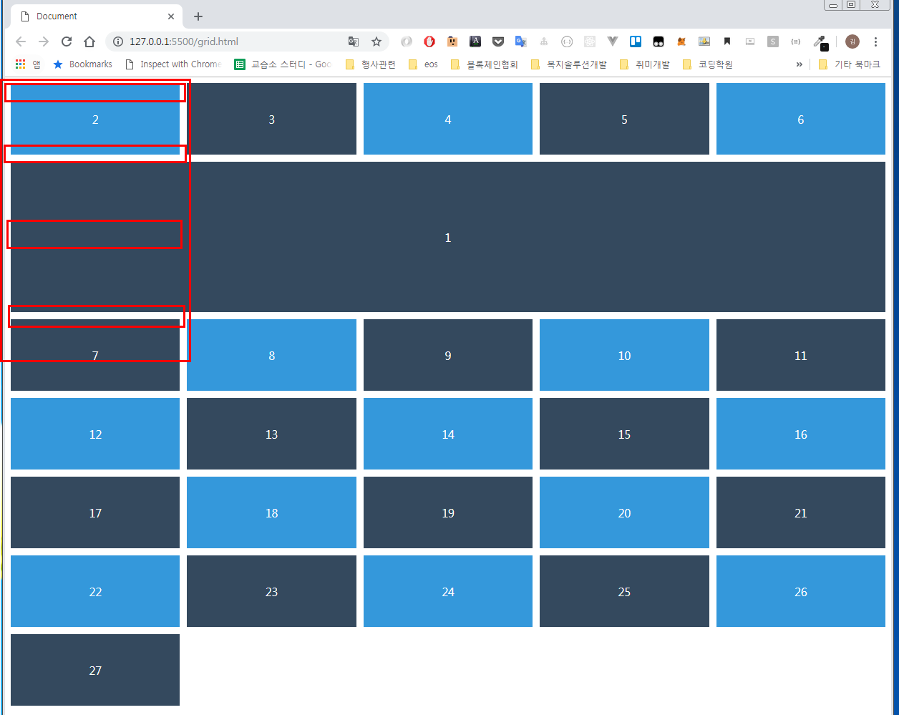

```
        .box:first-child {
            grid-area: span 4 / span 4;
        }
```

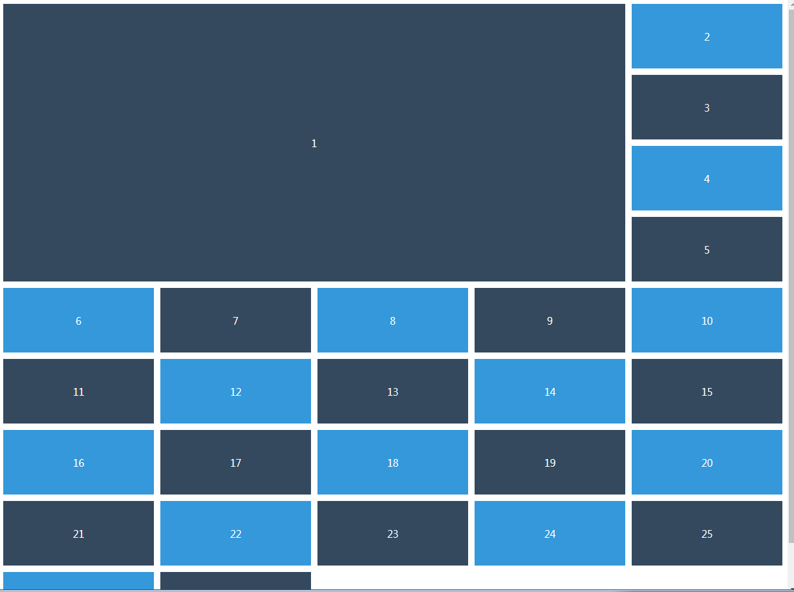

### justify, align, place self

> 내부적으로 아이템들을 좀 더 다른 위치로 만들고 싶은 경우 사용한다. 
>
> 어떤건 왼쪽 위로 올라가고 어떤건 하단 오른쪽으로 이동하게 구성

```
.box:first-child {
    justify-self: center;
    align-self:center;
}
```

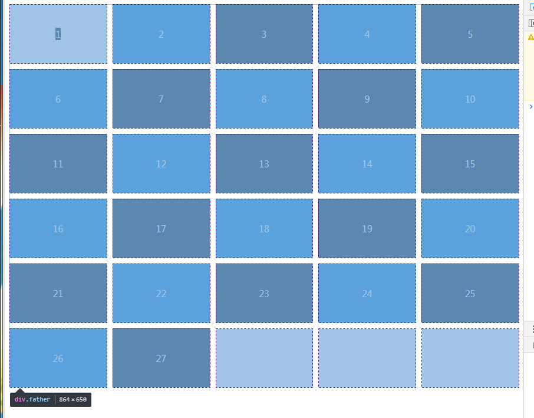

> `place-self: center`  으로도 똑같이 적용가능하다. 

이상으로 CSS 공부한 내용이었다. 다음시간에는 `PostCSS` 를 배워보도록 하자. 

참석해주셔서 감사합니다. 